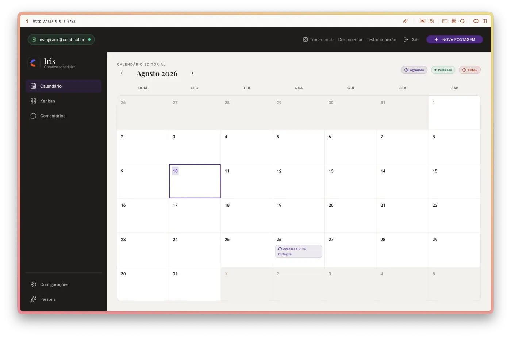
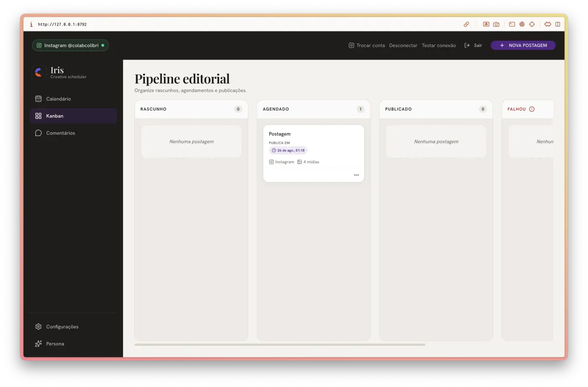
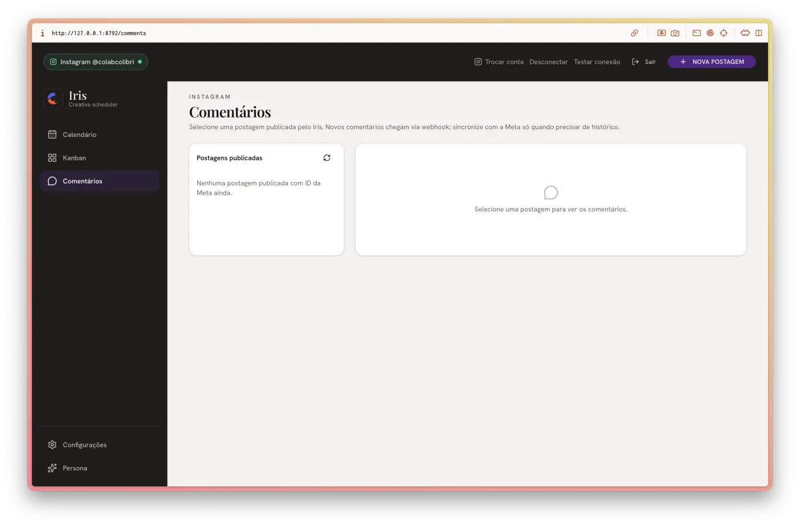
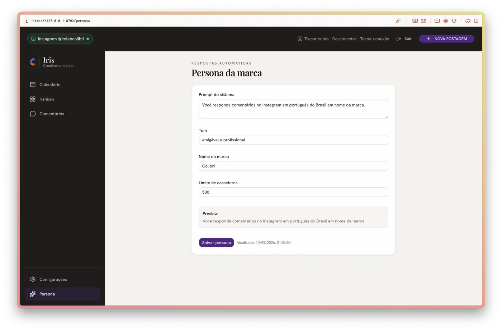
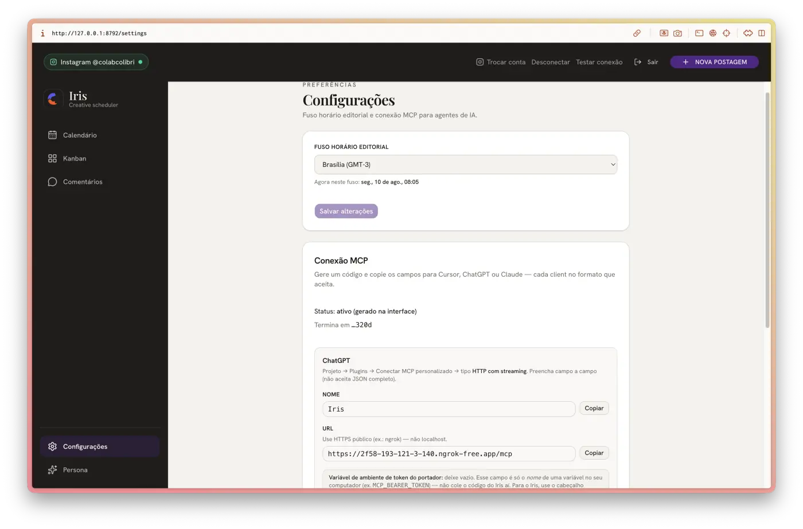

<p align="center">
  
</p>

<h1 align="center">Iris</h1>

<p align="center">
  <strong>Your editorial agent and social media manager.</strong><br />
  Iris publishes to your Instagram and replies to people commenting, always in your brand's voice — at whatever level of autonomy you choose.
</p>

<p align="center">
  <a href="README.md">Português (BR)</a> ·
  <a href="#what-it-is">What it is</a> ·
  <a href="#what-it-does">What it does</a> ·
  <a href="#how-it-works">How it works</a> ·
  <a href="#comment-replies">Comment replies</a> ·
  <a href="#external-agents-mcp--rest">External agents</a> ·
  <a href="#interface">Interface</a> ·
  <a href="#quick-start">Quick start</a> ·
  <a href="#documentation">Documentation</a>
</p>

<p align="center">
  
  
  
  
  
  
</p>

<p align="center">
  
</p>

---

## What it is

**Iris** is a self-hosted server with a web admin that runs your brand's Instagram: schedule, publish on time, and **reply to comments in the brand's voice**.

Three roles — keep them straight:

| Who | What they do |
| --- | ------------ |
| **You in the admin** | Plan, review on calendar/kanban, set persona and autonomy |
| **Iris itself** | Publishes on schedule and runs the comment-reply pipeline |
| **External agents** (Cursor, Claude, ChatGPT) | Create/edit/schedule posts via MCP or REST — they **do not** publish alone |

---

## What it does

- **Calendar and kanban** — drafts, scheduled, and published posts in one place
- **On-time publishing** — worker posts to Instagram via the official Graph API
- **Comment replies** — reads the comment and post context; replies with judgment, persona, and limits you set
- **Optional MCP / REST** — your AI assistant creates and schedules posts without opening the admin
- **Self-hosted** — SQLite + media on disk; Meta tokens encrypted; your own Meta app per deployment

---

## How it works

Four steps, from planning to conversation:

1. **Plan** — you (or an external agent) write the caption and upload images
2. **Review** — calendar or kanban; nothing goes live without this step
3. **Publish** — at `scheduled_at`, Iris's worker publishes to Instagram
4. **Reply** — when someone comments, Iris decides, drafts, and (if allowed) replies in the brand voice

```txt
Admin / MCP / REST   →  create, edit, schedule, upload media
Iris (server+worker) →  publish on time, sync and reply to comments
Instagram (Graph API)→  final destination
```

Optional local package (`publications/…/post.md` + images): [`docs/architecture/local-publications.md`](docs/architecture/local-publications.md).

---

## Comment replies

Core feature: Iris does not only publish — it **talks** to people who comment, with guardrails.

### What happens

1. A comment arrives (Meta webhook or sync)
2. Iris builds context (comment text + post / carousel)
3. Multi-step pipeline: **decide whether to reply** → **draft** → **review its own text**
4. Outcome: draft for approval, automatic send within limits, or skip (not worth replying / blocked content)

### Persona and limits

In the admin you set tone, language, signature, and limits (e.g. max length). Replies follow the brand persona — not a generic chatbot voice.

### Configurable autonomy

| Mode | Behavior |
| ---- | -------- |
| **Approve first** | Draft stays in the admin; you release the send |
| **Auto within limits** | Sends on its own when triage and verification pass |
| **Delay** | Configurable wait before send — last chance to review |
| **Per post or global** | Turn auto-reply on/off everywhere or only on specific posts |

### Simulation and history

- **Simulator** — try persona and rules without publishing for real
- **Audit trail** — every automatic reply logs the steps (triage → draft → verification) for inspection in the admin

### Anti prompt-injection

Comments sometimes try to “hack” the assistant with hidden instructions. Iris treats comment text as **untrusted input**: a comment cannot change tone, language, or brand rules.

---

## External agents (MCP / REST)

A different kind of AI — **not** the comment pipeline above.

Cursor, Claude, or ChatGPT can create and schedule posts. They **do not** publish to Instagram: publishing stays with Iris's worker at the scheduled time.

| Door | Credential | Typical use |
| ---- | ---------- | ----------- |
| **REST** (`/api/*`) | `IRIS_AGENT_TOKEN` | Scripts, CI, push from `publications/` |
| **MCP** (`POST /mcp`) | connection code (UI or `IRIS_MCP_CONNECTION_CODE`) | Chat: create/edit posts, media, calendar, comments |

MCP tools (summary): `iris_list_posts`, `iris_get_post`, `iris_create_post`, `iris_update_post`, `iris_list_post_assets`, `iris_prepare_post_asset_upload`, `iris_delete_post_asset`, `iris_generate_post_carousel_summary`, `iris_list_post_comments`, plus reply-context and insights tools.

Per-client setup: [`docs/architecture/mcp-integration.md`](docs/architecture/mcp-integration.md).

---

## Interface

Calendar, kanban, comment inbox, persona, and MCP connection — one admin.

<p align="center">
  <strong>Editorial kanban pipeline</strong><br />
  
</p>

<table>
  <tr>
    <td align="center" width="50%">
      <strong>Comment inbox</strong><br />
      
    </td>
    <td align="center" width="50%">
      <strong>Brand persona</strong><br />
      
    </td>
  </tr>
  <tr>
    <td align="center" colspan="2">
      <strong>MCP connection</strong> — Cursor, ChatGPT, Claude<br />
      
    </td>
  </tr>
</table>

---

## Quick start

**Requirements:** Node.js ≥ 22, [pnpm](https://pnpm.io/). To publish to Instagram: Business/Creator account + [Meta app for your deployment](docs/architecture/meta-integration.md).

```bash
git clone https://github.com/colabcolibri/iris.git
cd iris/iris-app
cp .env.example .env
pnpm install
pnpm dev
```

Open **http://127.0.0.1:8792** — one process serves API, UI, and HMR.

**Email in dev:** [Mailpit](https://github.com/axllent/mailpit) (SMTP `:1025`, UI `:8025`) to see OTP codes.

```bash
# Local production (static bundle)
pnpm build:admin
NODE_ENV=production pnpm start
```

```bash
cd iris-app && pnpm test
```

Workspace details: [`iris-app/README.md`](iris-app/README.md).

---

## Repository

| Path | Description |
| ---- | ----------- |
| [`iris-app/server/`](iris-app/server/) | HTTP API, workers, MCP, SQLite migrations |
| [`iris-app/admin/`](iris-app/admin/) | React SPA (Vite) |
| [`iris-app/public/`](iris-app/public/) | Static admin bundle (Vite output) |
| [`docs/`](docs/) | Scope, architecture, API, design system |
| [`iris-agent/`](iris-agent/) | Optional local kit (`publications/`, MCP scripts) |

> `publications/` and credentials stay on your machine — not in git.

---

## Deploy

`Dockerfile` and `railway.toml` at the **root** (build → `iris-app/`). Volume at `/app/data`. Healthcheck: `GET /health`.

Short checklist: `IRIS_PUBLIC_BASE_URL`, Meta app from the **deployment operator**, webhook `{base}/webhooks/meta`, Resend in production, `IRIS_TOKEN_ENCRYPTION_KEY`. Secrets only in the provider dashboard.

Guide: [`docs/08_environments.md`](docs/08_environments.md) · variables: [`iris-app/.env.railway.example`](iris-app/.env.railway.example).

---

## Stack

Node 22 + TypeScript · `node:http` · SQLite (`node:sqlite`) · React 19 / Vite / Tailwind · `sharp` · MCP SDK · SMTP/Resend · Instagram Graph API + webhooks.

---

## Documentation

| Doc | Content |
| --- | ------- |
| [`docs/00_scope.md`](docs/00_scope.md) | Scope and problem |
| [`docs/05_architecture.md`](docs/05_architecture.md) | Architecture and flows (incl. reply agent) |
| [`docs/07_api_contracts.md`](docs/07_api_contracts.md) | REST contracts |
| [`docs/08_environments.md`](docs/08_environments.md) | Variables and environments |
| [`docs/architecture/meta-integration.md`](docs/architecture/meta-integration.md) | Instagram — OAuth, webhooks, BYOA |
| [`docs/architecture/mcp-integration.md`](docs/architecture/mcp-integration.md) | MCP — Cursor, ChatGPT, Claude |
| [`docs/architecture/diagrams/iris-reply-agent-flow.md`](docs/architecture/diagrams/iris-reply-agent-flow.md) | Comment-reply agent flow |

Meridian backlog (optional, not part of the runtime): [`AGENTS.md`](AGENTS.md).

---

## Security

- Meta, LLM, and session tokens **server-side only**
- Admin: email OTP + HttpOnly cookie + SPA route gate
- Distinct REST and MCP credentials, limited scope
- Comments treated as untrusted input in the reply pipeline

Report vulnerabilities through the maintainer's private channel — do not open a public issue with exploit details.

---

## License

[PolyForm Noncommercial License 1.0.0](LICENSE) — **Colab Colibri**.

Free use, modification, and distribution for **noncommercial** purposes. Commercial use requires explicit authorization from the maintainer.

---

<p align="center">
  
  <sub>Iris — publishes on time and replies to comments, in your brand's voice</sub>
</p>
