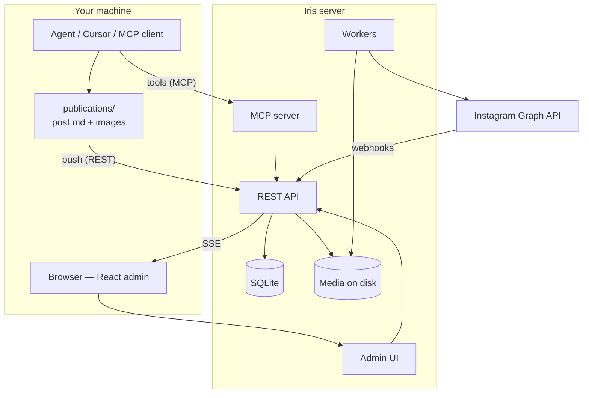

<p align="center">
  
</p>

<h1 align="center">Iris</h1>

<p align="center">
  <strong>Instagram editorial manager built for humans and AI agents.</strong><br />
  Calendar, scheduling, automatic publishing, and comment inbox — MCP and REST for editorial ops; the worker publishes to Instagram.
</p>

<p align="center">
  <a href="README.md">Português (BR)</a> ·
  <a href="#interface">Interface</a> ·
  <a href="#the-problem">The problem</a> ·
  <a href="#why-iris">Why Iris</a> ·
  <a href="#how-it-works">How it works</a> ·
  <a href="#ai-agents">AI agents</a> ·
  <a href="#quick-start">Quick start</a> ·
  <a href="#documentation">Documentation</a>
</p>

<p align="center">
  
  
  
  
  
</p>

<p align="center">
  
</p>

---

## Interface

Calendar, kanban, comment inbox, MCP connection, and brand persona for auto-reply — all in one admin.

<p align="center">
  <strong>Editorial kanban pipeline</strong><br />
  
</p>

<table>
  <tr>
    <td align="center" width="50%">
      <strong>Comment inbox</strong><br />
      
    </td>
    <td align="center" width="50%">
      <strong>MCP connection</strong><br />
      
    </td>
  </tr>
  <tr>
    <td align="center" colspan="2">
      <strong>Brand persona</strong> — tone and prompt for automatic replies<br />
      
    </td>
  </tr>
</table>

---

## The problem

Managing Instagram today is often a Frankenstein setup:

| Without Iris | With Iris |
| ------------ | --------- |
| Spreadsheets, notes, and phone reminders | Centralized editorial calendar |
| Scheduling a post = opening the app manually | Worker publishes on time via Graph API |
| Images scattered in local folders | Media on the server, optimized and ready to publish |
| Comments lost in IG notifications | Synced inbox with hierarchy and auto-reply |
| AI agents with no secure editorial API | REST + MCP — Cursor, Claude, and ChatGPT create, edit, and schedule; the server publishes |

**Iris** is a Node mini-server with a web UI that solves this end to end. Best of all, it is **creation-tool agnostic**. It does not matter if content came from Canva, a manual export, or another agent — you assemble `post.md` + images and Iris handles the rest.

---

## Why Iris

### Built for AI agents, not retrofitted later

Most social media tools were designed for human clicks. Iris was built with two operators in mind: **you in the browser** and **your agent in Cursor**.

- **MCP server** with editorial tools (`iris_create_post`, `iris_list_posts`, `iris_upload_post_asset`, …)
- **REST API** with Bearer token for batch automation
- **Real-time SSE** — the UI updates when someone edits via admin, API, or worker

### One server, clear responsibility

```txt
Operator / MCP agent  →  create, edit, schedule, upload media (API or admin)
Iris server + worker  →  store, publish on schedule, sync comments
Instagram             →  final destination via official Graph API
```

No coupling to Casper, Canva, or any creator. Iris does not need to know where content came from — only the caption, images, and schedule.

### Self-hosted and under your control

- SQLite + files on disk — no database or object storage vendor lock-in
- Meta tokens encrypted in the server vault
- Email OTP login, HttpOnly session
- Deploy on Docker/Railway with persistent volume at `/app/data`

### Lean stack, no magic

Native Node 22 (`node:http`, `node:sqlite`), TypeScript, React 19, sharp for image optimization. No Express, no ORM, no over-engineering.

---

## How it works



### Typical flow — from draft to feed

1. **Create** — in the UI or via agent (`iris_create_post`)
2. **Upload media** — multipart upload or base64 via MCP; the server resizes and converts to JPEG
3. **Schedule** — set `scheduled_at`; the worker publishes on time
4. **Track** — monthly calendar or kanban by status (`draft` → `scheduled` → `published`)
5. **Comments** — Meta webhook syncs; inbox in the UI with contextual auto-reply (optional LLM)

### Local content package

```txt
publications/product-launch-x/    # on your machine — gitignored
  post.md          # YAML frontmatter + caption
  01.png
  02.png
```

```yaml
---
title: Product X launch
scheduled_at: 2026-08-12T18:00:00.000Z
channel: instagram
status: ready
---

Post caption.

#product #launch
```

The API receives the package → Iris creates the post, uploads images, and schedules; the **worker** publishes to Instagram on time.

Details: [`docs/architecture/local-publications.md`](docs/architecture/local-publications.md).

---

## Features

| Area | What you get |
| ---- | ------------ |
| **Calendar & kanban** | Monthly and status views — find drafts, scheduled, and published posts at a glance |
| **Media** | Multipart upload, automatic optimization (resize + JPEG) on the server |
| **Scheduling** | Worker publishes at the exact time via Graph API |
| **Comments** | Inbox with hierarchy, webhook sync, and contextual auto-reply |
| **Meta OAuth** | Connect Instagram from the admin; encrypted tokens |
| **Auth** | Email OTP login, HttpOnly session, protected routes |
| **Real-time** | SSE — the UI reacts without polling |
| **MCP** | Editorial tools for Cursor, Claude Desktop, and ChatGPT |

---

## AI agents

Iris exposes **two doors** for automation:

| Door | Token | Best for |
| ---- | ----- | -------- |
| **REST** (`/api/*`) | `IRIS_AGENT_TOKEN` | Automation, scripts, CI — create posts, upload media, schedule |
| **MCP** (`POST /mcp`) | `IRIS_MCP_CONNECTION_CODE` | Create/edit posts in chat, query calendar and comments |

### Available MCP tools

| Tool | What it does |
| ---- | ------------ |
| `iris_list_posts` | List posts with status and date filters |
| `iris_get_post` | Post details + asset metadata |
| `iris_create_post` | Create post with caption and schedule |
| `iris_update_post` | Update caption, status, or time |
| `iris_upload_post_asset` | Upload image (base64) to a post |
| `iris_list_post_comments` | Synced comments for a post |

Per-client setup: [`docs/architecture/mcp-integration.md`](docs/architecture/mcp-integration.md).

---

## Repository

Product monorepo in two areas:

| Path | Description |
| ---- | ----------- |
| [`iris-app/`](iris-app/) | Node server, API, React admin (Vite), workers, and SQLite migrations |
| [`docs/`](docs/) | Product, architecture, API, and design system docs |

> Local content packages (`publications/`, automation credentials) stay on your machine — not in git. See [`docs/architecture/local-publications.md`](docs/architecture/local-publications.md).

---

## Quick start

**Requirements:** Node.js ≥ 22, [pnpm](https://pnpm.io/), Instagram Business/Creator account + Meta app (for production).

```bash
git clone https://github.com/colabcolibri/iris.git
cd iris/iris-app
cp .env.example .env
pnpm install
pnpm dev
```

Open **http://127.0.0.1:8792** — a single process serves API, UI, and HMR in development.

**Email in dev:** run [Mailpit](https://github.com/axllent/mailpit) (SMTP `:1025`, UI `:8025`). OTP codes appear in the Mailpit UI.

```bash
# Local production (static bundle)
pnpm build:admin
NODE_ENV=production pnpm start
```

**Tests:**

```bash
cd iris-app
pnpm test
```

---

## Deploy

The repo includes `Dockerfile` and `railway.toml` at the **root** (monorepo build → `iris-app/`).

| Item | Suggested value |
| ---- | --------------- |
| Volume | Mount at `/app/data` (SQLite + media) |
| Healthcheck | `GET /health` |
| Variables | See [`iris-app/.env.railway.example`](iris-app/.env.railway.example) |

**Production checklist:**

- `IRIS_PUBLIC_BASE_URL` — public HTTPS URL
- `META_OAUTH_REDIRECT_URI` — `{base}/auth/meta/callback`
- Meta webhook — `{base}/webhooks/meta`
- `IRIS_EMAIL_PROVIDER=resend` + `RESEND_API_KEY` + verified sender
- `IRIS_TOKEN_ENCRYPTION_KEY` — strong key (64 hex or long passphrase)

Configure secrets **only in the provider dashboard**. Never commit `.env` with real values.

Full guide: [`docs/08_environments.md`](docs/08_environments.md).

---

## Stack

| Layer | Technology |
| ----- | ---------- |
| Runtime | Node 22+, TypeScript (strip types) |
| HTTP | Native `node:http` |
| Data | SQLite (`node:sqlite`) + migrations |
| UI | React 19, Vite, Tailwind, shadcn/ui |
| Media | `sharp` |
| AI | MCP SDK + editorial tools |
| Email | SMTP (dev) / Resend (prod) |
| Meta | Instagram Graph API + webhooks |

---

## Documentation

| Doc | Content |
| --- | ------- |
| [`docs/00_scope.md`](docs/00_scope.md) | Scope, personas, and problem solved |
| [`docs/05_architecture.md`](docs/05_architecture.md) | Architecture, layers, and flows |
| [`docs/07_api_contracts.md`](docs/07_api_contracts.md) | REST contracts |
| [`docs/08_environments.md`](docs/08_environments.md) | Variables and environments |
| [`docs/architecture/mcp-integration.md`](docs/architecture/mcp-integration.md) | MCP — Cursor, ChatGPT, Claude |
| [`iris-app/README.md`](iris-app/README.md) | Application package details |

---

## Development with Meridian (optional)

This repository uses the [Meridian](https://github.com/colabcolibri/meridian) protocol for backlog and phase docs. The `.agent/` kit includes **Python scripts for project governance only** — not part of the Iris runtime (100% Node/TypeScript).

```bash
python3 .agent/scripts/validate_meridian.py .   # only if you maintain the Meridian backlog
```

---

## Security

- Meta, LLM, and session keys **server-side only**
- `.env`, `iris.credentials.json`, and `data/` are in `.gitignore`
- Admin protected by OTP + HttpOnly cookie + server-side gate on SPA routes
- REST (automation) and MCP tokens are distinct with limited scope

Report vulnerabilities through the maintainer's private channel — do not open a public issue with exploit details.

---

## License

Proprietary code — **Colab Colibri**. Use, copy, and distribution only with explicit authorization. See [`iris-app/package.json`](iris-app/package.json) (`UNLICENSED`).

---

<p align="center">
  
  <sub>Iris — Instagram editorial manager, native for AI agents</sub>
</p>
