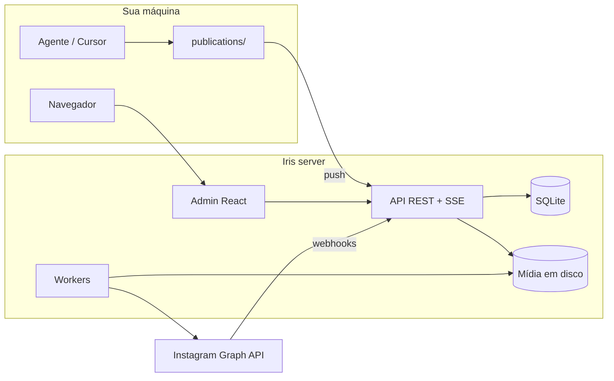

<p align="center">
  
</p>

<h1 align="center">Iris</h1>

<p align="center">
  <strong>Agenda, publica e acompanha o Instagram — calendário editorial, API para agentes de IA e inbox de comentários.</strong>
</p>

<p align="center">
  <a href="#funcionalidades">Funcionalidades</a> ·
  <a href="#quick-start">Quick start</a> ·
  <a href="#deploy">Deploy</a> ·
  <a href="#agente-local">Agente local</a> ·
  <a href="#documentação">Documentação</a>
</p>

<p align="center">
  
  
  
  
</p>

---

## O que é

**Iris** é um mini-server Node com interface web para operação editorial no Instagram. Ele centraliza rascunhos, agendamentos e publicações, armazena mídia no servidor, sincroniza comentários e expõe uma API REST para agentes de IA publicarem conteúdo de forma segura.

O produto é **genérico**: não depende de Canva, Notion ou qualquer ferramenta de criação. Você (ou um agente no Cursor) monta pacotes locais em `post.md` + imagens e envia ao Iris via API.



---

## Funcionalidades

| Área | O que você ganha |
| ---- | ---------------- |
| **Calendário & kanban** | Visão mensal e por status (`draft`, `scheduled`, `published`, …) |
| **Mídia** | Upload multipart, otimização (resize + JPEG) no servidor |
| **Agendamento** | Worker publica no horário via Graph API |
| **Comentários** | Inbox com hierarquia, sync e auto-reply contextual (LLM opcional) |
| **Meta OAuth** | Conexão Instagram pelo admin, tokens criptografados no vault |
| **Auth** | Login OTP por email, sessão HttpOnly, rotas protegidas |
| **Agentes** | Bearer token + skill `push-publication` para automação |
| **Tempo real** | SSE para atualizar a UI sem polling |

---

## Repositório

Monorepo organizado em três áreas:

| Caminho | Descrição |
| ------- | --------- |
| [`iris-app/`](iris-app/) | Servidor Node, API, admin React (Vite), workers e migrations SQLite |
| [`iris-agent/`](iris-agent/) | Kit portável do agente local (sem Node) — `publications/` + credenciais |
| [`docs/`](docs/) | Documentação de produto, arquitetura, API e design system |

O fluxo editorial local:

```txt
iris-app/publications/{slug}/
  post.md          # frontmatter + legenda
  01.png
  02.png
        │
        ▼  agente push (curl / skill)
   Iris server  ──►  Instagram
```

Detalhes: [`docs/architecture/local-publications.md`](docs/architecture/local-publications.md).

---

## Quick start

**Requisitos:** Node.js ≥ 22, [pnpm](https://pnpm.io/), conta Instagram Business/Creator + app Meta (para produção).

```bash
git clone https://github.com/colabcolibri/iris.git
cd iris/iris-app
cp .env.example .env
pnpm install
pnpm dev
```

Abra **http://127.0.0.1:8792** — um único processo serve API, UI e HMR em desenvolvimento.

**Email em dev:** suba o [Mailpit](https://github.com/axllent/mailpit) (SMTP `:1025`, UI `:8025`). Os códigos OTP aparecem na interface do Mailpit.

```bash
# Produção local (bundle estático)
pnpm build:admin
NODE_ENV=production pnpm start
```

**Testes:**

```bash
cd iris-app
pnpm test
```

---

## Deploy

O repositório inclui `Dockerfile` e `railway.toml` na **raiz** (build do monorepo → `iris-app/`).

| Item | Valor sugerido |
| ---- | -------------- |
| Volume | Monte em `/app/data` (SQLite + mídia) |
| Healthcheck | `GET /health` |
| Variáveis | Ver [`iris-app/.env.railway.example`](iris-app/.env.railway.example) |

**Importante:** configure secrets **apenas no painel do provedor** (Resend, Meta, session secrets). Nunca commite `.env` com valores reais.

Checklist de produção:

- `IRIS_PUBLIC_BASE_URL` — URL HTTPS pública
- `META_OAUTH_REDIRECT_URI` — `{base}/auth/meta/callback`
- Webhook Meta — `{base}/webhooks/meta`
- `IRIS_EMAIL_PROVIDER=resend` + `RESEND_API_KEY` + remetente verificado
- `IRIS_TOKEN_ENCRYPTION_KEY` — chave forte (64 hex ou passphrase longa)

Guia completo: [`docs/08_environments.md`](docs/08_environments.md).

---

## Agente local

O pacote [`iris-agent/`](iris-agent/) é portável: copie a pasta, configure credenciais e use o skill Meridian `push-publication`.

```bash
cd iris-agent
cp iris.credentials.example.json iris.credentials.json
# Edite apiUrl e agentToken (mesmo IRIS_AGENT_TOKEN do server)
```

No Cursor, invoque `@iris-local` ou o workflow de push para enviar `publications/` ao servidor.

---

## Stack

| Camada | Tecnologia |
| ------ | ---------- |
| Runtime | Node 22+, TypeScript (strip types) |
| HTTP | `node:http` nativo — sem Express |
| Dados | SQLite (`node:sqlite`) + migrations |
| UI | React 19, Vite, Tailwind, shadcn/ui |
| Mídia | `sharp` |
| Email | SMTP (dev) / Resend (prod) |
| Meta | Instagram Graph API + webhooks |

---

## Documentação

| Doc | Conteúdo |
| --- | -------- |
| [`docs/00_scope.md`](docs/00_scope.md) | Escopo e personas |
| [`docs/05_architecture.md`](docs/05_architecture.md) | Arquitetura e fluxos |
| [`docs/07_api_contracts.md`](docs/07_api_contracts.md) | Contratos REST |
| [`docs/08_environments.md`](docs/08_environments.md) | Variáveis e ambientes |
| [`iris-app/README.md`](iris-app/README.md) | Detalhes do pacote da aplicação |

---

## Desenvolvimento com Meridian

Este repositório usa o protocolo [Meridian](https://github.com/colabcolibri/meridian) para backlog, user stories e phase docs. O kit vive em `.agent/`; o backlog em `.meridian/` (SQLite, gitignored).

```bash
python3 .agent/scripts/validate_meridian.py .
```

---

## Segurança

- Tokens Meta, LLM e chaves de sessão **somente no servidor**
- `.env`, `iris.credentials.json` e `data/` estão no `.gitignore`
- Admin protegido por OTP + cookie HttpOnly + gate server-side nas rotas SPA
- Agente usa Bearer com escopo limitado

Reporte vulnerabilidades pelo canal privado do mantenedor — não abra issue pública com detalhes de exploit.

---

## Licença

Código proprietário — **Colab Colibri**. Uso, cópia e distribuição apenas com autorização explícita. Ver [`iris-app/package.json`](iris-app/package.json) (`UNLICENSED`).

---

<p align="center">
  
  <sub>Iris — gestor editorial para Instagram</sub>
</p>
