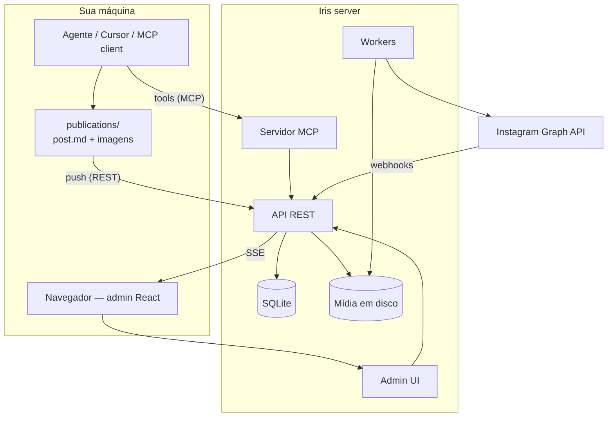

<p align="center">
  
</p>

<h1 align="center">Iris</h1>

<p align="center">
  <strong>O gestor editorial do Instagram feito para humanos e agentes de IA.</strong><br />
  Calendário, agendamento, publicação automática e inbox de comentários — MCP e REST para operar o editorial; o worker publica no Instagram.
</p>

<p align="center">
  <a href="README.en.md">English</a> ·
  <a href="#interface">Interface</a> ·
  <a href="#o-problema">O problema</a> ·
  <a href="#por-que-iris">Por que Iris</a> ·
  <a href="#como-funciona">Como funciona</a> ·
  <a href="#agentes-de-ia">Agentes de IA</a> ·
  <a href="#quick-start">Quick start</a> ·
  <a href="#documentação">Documentação</a>
</p>

<p align="center">
  
  
  
  
  
  
</p>

<p align="center">
  
</p>

---

## Interface

Calendário, kanban, inbox de comentários, conexão MCP e persona para auto-reply — tudo no mesmo admin.

<p align="center">
  <strong>Pipeline kanban</strong><br />
  
</p>

<table>
  <tr>
    <td align="center" width="50%">
      <strong>Inbox de comentários</strong><br />
      
    </td>
    <td align="center" width="50%">
      <strong>Conexão MCP</strong><br />
      
    </td>
  </tr>
  <tr>
    <td align="center" colspan="2">
      <strong>Persona da marca</strong> — tom e prompt para respostas automáticas<br />
      
    </td>
  </tr>
</table>

---

## O problema

Gerenciar Instagram hoje costuma ser um Frankenstein:

| Sem Iris | Com Iris |
| -------- | -------- |
| Planilhas, notas e lembretes no celular | Calendário editorial centralizado |
| Agendar post = abrir app manualmente | Worker publica no horário via Graph API |
| Imagens espalhadas em pastas locais | Mídia no servidor, otimizada e pronta para publicar |
| Comentários perdidos na notificação do IG | Inbox sincronizada com hierarquia e auto-reply |
| Agentes de IA sem API segura para o editorial | REST + MCP — Cursor, Claude e ChatGPT criam, editam e agendam; o servidor publica |

**Iris** é um mini-server Node com interface web que resolve isso de ponta a ponta. E o melhor: é **agnóstico de ferramenta de criação**. Não importa se o conteúdo veio do Canva, de um export manual ou de outro agente — você monta `post.md` + imagens e o Iris cuida do resto.

---

## Por que Iris

### Feito para agentes de IA, não adaptado depois

A maioria das ferramentas de social media foi pensada para cliques humanos. Iris nasceu com dois operadores em mente: **você no navegador** e **seu agente no Cursor**.

- **Servidor MCP** com tools editoriais (`iris_create_post`, `iris_list_posts`, `iris_upload_post_asset`, …)
- **API REST** com Bearer token para automação em lote
- **SSE em tempo real** — a UI atualiza quando alguém edita via admin, API ou worker

### Um servidor, responsabilidade clara

```txt
Operador / agente MCP  →  cria, edita, agenda, sobe mídia (API ou admin)
Iris server + worker   →  armazena, dispara publicação no horário, sincroniza comentários
Instagram              →  destino final via Graph API oficial
```

Sem acoplamento a Casper, Canva ou qualquer criador. O Iris não precisa saber de onde veio o conteúdo — só precisa da legenda, das imagens e do horário.

### Self-hosted e sob seu controle

- SQLite + arquivos em disco — sem vendor lock-in de banco ou object storage
- Tokens Meta criptografados no vault do servidor
- Login OTP por email, sessão HttpOnly
- Deploy em Docker/Railway com volume persistente em `/app/data`
- **App Meta próprio por deploy** — quem self-host cria o app na Meta; quem você hospeda usa o seu. Operadores só conectam a conta Instagram no admin. Ver [`docs/architecture/meta-integration.md`](docs/architecture/meta-integration.md).

### Stack enxuta, sem magia

Node 22 nativo (`node:http`, `node:sqlite`), TypeScript, React 19, sharp para otimização de imagem. Sem Express, sem ORM, sem over-engineering.

---

## Como funciona



### Fluxo típico — do rascunho ao feed

1. **Criar** — na UI ou via agente (`iris_create_post`)
2. **Subir mídia** — upload multipart ou base64 via MCP; o server redimensiona e converte para JPEG
3. **Agendar** — define `scheduled_at`; o worker publica no horário
4. **Acompanhar** — calendário mensal ou kanban por status (`draft` → `scheduled` → `published`)
5. **Comentários** — webhook Meta sincroniza; inbox na UI com auto-reply contextual (LLM opcional)

### Pacote local de conteúdo

```txt
publications/lancamento-produto-x/    # na sua máquina — gitignored
  post.md          # frontmatter YAML + legenda
  01.png
  02.png
```

```yaml
---
title: Lançamento produto X
scheduled_at: 2026-08-12T18:00:00.000Z
channel: instagram
status: ready
---

Legenda da publicação.

#produto #lançamento
```

A API recebe o pacote → Iris cria o post, sobe as imagens e agenda; o **worker** publica no Instagram no horário.

Detalhes: [`docs/architecture/local-publications.md`](docs/architecture/local-publications.md).

---

## Funcionalidades

| Área | O que você ganha |
| ---- | ---------------- |
| **Calendário & kanban** | Visão mensal e por status — encontre rascunhos, agendados e publicados num relance |
| **Mídia** | Upload multipart, otimização automática (resize + JPEG) no servidor |
| **Agendamento** | Worker publica no horário exato via Graph API |
| **Comentários** | Inbox com hierarquia, sync por webhook e auto-reply contextual |
| **Meta OAuth** | Conexão Instagram pelo admin; tokens criptografados |
| **Auth** | Login OTP por email, sessão HttpOnly, rotas protegidas |
| **Tempo real** | SSE — a UI reage sem polling |
| **MCP** | Tools editoriais para Cursor, Claude Desktop e ChatGPT |

---

## Agentes de IA

Iris expõe **duas portas** para automação:

| Porta | Token | Melhor para |
| ----- | ----- | ----------- |
| **REST** (`/api/*`) | `IRIS_AGENT_TOKEN` | Automação, scripts, CI — criar posts, subir mídia, agendar |
| **MCP** (`POST /mcp`) | `IRIS_MCP_CONNECTION_CODE` | Criar/editar posts no chat, consultar calendário e comentários |

### Tools MCP disponíveis

| Tool | O que faz |
| ---- | --------- |
| `iris_list_posts` | Lista posts com filtros de status e período |
| `iris_get_post` | Detalhes de um post + metadados de assets |
| `iris_create_post` | Cria post com legenda e agendamento |
| `iris_update_post` | Atualiza legenda, status ou horário |
| `iris_upload_post_asset` | Sobe imagem (base64) para um post |
| `iris_list_post_comments` | Comentários sincronizados de um post |

Setup por client: [`docs/architecture/mcp-integration.md`](docs/architecture/mcp-integration.md).

---

## Repositório

Monorepo em duas áreas de produto:

| Caminho | Descrição |
| ------- | --------- |
| [`iris-app/`](iris-app/) | Servidor Node, API, admin React (Vite), workers e migrations SQLite |
| [`docs/`](docs/) | Documentação de produto, arquitetura, API e design system |

> Pacotes locais (`publications/`, credenciais de automação) ficam na sua máquina — não entram no git. Ver [`docs/architecture/local-publications.md`](docs/architecture/local-publications.md).

---

## Quick start

**Requisitos:** Node.js ≥ 22, [pnpm](https://pnpm.io/). Para publicar no Instagram: conta Business/Creator + [app Meta no seu deploy](docs/architecture/meta-integration.md) (cada instância usa credenciais próprias — não compartilhe secrets no repo).

```bash
git clone https://github.com/colabcolibri/iris.git
cd iris/iris-app
cp .env.example .env
pnpm install
pnpm dev
```

Abra **http://127.0.0.1:8792** — um único processo serve API, UI e HMR em desenvolvimento.

**Email em dev:** suba o [Mailpit](https://github.com/axllent/mailpit) (SMTP `:1025`, UI `:8025`). Os códigos OTP aparecem na interface do Mailpit.

```bash
# Produção local (bundle estático)
pnpm build:admin
NODE_ENV=production pnpm start
```

**Testes:**

```bash
cd iris-app
pnpm test
```

---

## Deploy

O repositório inclui `Dockerfile` e `railway.toml` na **raiz** (build do monorepo → `iris-app/`).

| Item | Valor sugerido |
| ---- | -------------- |
| Volume | Monte em `/app/data` (SQLite + mídia) |
| Healthcheck | `GET /health` |
| Variáveis | Ver [`iris-app/.env.railway.example`](iris-app/.env.railway.example) |

**Checklist de produção:**

- `IRIS_PUBLIC_BASE_URL` — URL HTTPS pública
- `META_INSTAGRAM_APP_ID` + `META_INSTAGRAM_APP_SECRET` — app **do operador do deploy**, não do repositório
- `META_OAUTH_REDIRECT_URI` — `{base}/auth/meta/callback`
- Webhook Meta — `{base}/webhooks/meta`
- `IRIS_EMAIL_PROVIDER=resend` + `RESEND_API_KEY` + remetente verificado
- `IRIS_TOKEN_ENCRYPTION_KEY` — chave forte (64 hex ou passphrase longa)

Configure secrets **apenas no painel do provedor**. Nunca commite `.env` com valores reais.

Guia completo: [`docs/08_environments.md`](docs/08_environments.md).

---

## Stack

| Camada | Tecnologia |
| ------ | ---------- |
| Runtime | Node 22+, TypeScript (strip types) |
| HTTP | `node:http` nativo |
| Dados | SQLite (`node:sqlite`) + migrations |
| UI | React 19, Vite, Tailwind, shadcn/ui |
| Mídia | `sharp` |
| IA | MCP SDK + tools editoriais |
| Email | SMTP (dev) / Resend (prod) |
| Meta | Instagram Graph API + webhooks |

---

## Documentação

| Doc | Conteúdo |
| --- | -------- |
| [`docs/00_scope.md`](docs/00_scope.md) | Escopo, personas e problema que resolve |
| [`docs/05_architecture.md`](docs/05_architecture.md) | Arquitetura, camadas e fluxos |
| [`docs/07_api_contracts.md`](docs/07_api_contracts.md) | Contratos REST |
| [`docs/08_environments.md`](docs/08_environments.md) | Variáveis e ambientes |
| [`docs/architecture/meta-integration.md`](docs/architecture/meta-integration.md) | Instagram — BYOA, OAuth, webhooks, setup |
| [`docs/architecture/mcp-integration.md`](docs/architecture/mcp-integration.md) | MCP — Cursor, ChatGPT, Claude |
| [`iris-app/README.md`](iris-app/README.md) | Detalhes do pacote da aplicação |

---

## Desenvolvimento com Meridian (opcional)

Este repositório usa o protocolo [Meridian](https://github.com/colabcolibri/meridian) para backlog e phase docs. O kit em `.agent/` inclui scripts **Python só para governança do projeto** — não fazem parte do runtime do Iris (que é 100% Node/TypeScript).

```bash
python3 .agent/scripts/validate_meridian.py .   # só para quem mantém o backlog Meridian
```

---

## Segurança

- Tokens Meta, LLM e chaves de sessão **somente no servidor**
- `.env`, `iris.credentials.json` e `data/` estão no `.gitignore`
- Admin protegido por OTP + cookie HttpOnly + gate server-side nas rotas SPA
- Tokens REST (automação) e MCP usam credenciais distintas com escopo limitado

Reporte vulnerabilidades pelo canal privado do mantenedor — não abra issue pública com detalhes de exploit.

---

## Licença

Este projeto está sob [PolyForm Noncommercial License 1.0.0](LICENSE) — **Colab Colibri**.

Uso, modificação e distribuição gratuitos para fins **não comerciais** (pessoal, hobby, pesquisa, ONGs, educação, governo). Uso comercial (venda, SaaS pago, produto interno de empresa etc.) requer autorização explícita do mantenedor.

---

<p align="center">
  
  <sub>Iris — gestor editorial para Instagram, nativo para agentes de IA</sub>
</p>
