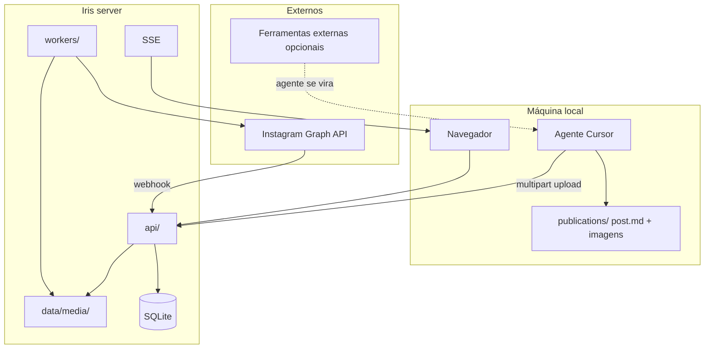

# 05 — Architecture

## Objective

Forma do Iris: mini-server com camadas SRP, mídia em disco, SQLite, UI HTML, Meta API. Pacote local em `publications/` — ver `docs/architecture/local-publications.md`.

## System context



**Repository layout:**

```txt
iris/                     # workspace Meridian
  docs/                   # phase docs do produto
  .meridian/              # backlog SQLite
  iris-app/               # aplicação Node
    publications/         # pacotes locais (post.md + imagens)
    src/
      domain/
      ports/
      adapters/sqlite/
      adapters/media-storage/
      adapters/meta/
      adapters/sse/
      api/
      workers/
      agents/             # LLM reply no server
      server.ts
    public/               # UI HTML
    migrations/
    data/
      iris.db
      media/{post_id}/
  .agent/                 # skills incl. push-publication
```

## Layers and boundaries

| Layer | Responsibility | Paths |
| ----- | -------------- | ----- |
| Domain | Post, asset, status, schedule rules | `src/domain/` |
| Ports | Repositories, MediaStorage, MetaPublisher | `src/ports/` |
| Adapters | SQLite, filesystem media, Meta, SSE | `src/adapters/` |
| API | REST + multipart | `src/api/` |
| Workers | publish-scheduler, comment-responder | `src/workers/` |

## Major components

| Component | Purpose | Path |
| --------- | ------- | ---- |
| Post API | CRUD + schedule | `src/api/routes/posts.ts` |
| Assets API | Multipart upload + serve | `src/api/routes/assets.ts` |
| Comments API | List + manual reply | `src/api/routes/comments.ts` |
| Events API | SSE | `src/api/routes/events.ts` |
| Media storage | `data/media/{post_id}/` | `src/adapters/media-storage/` |
| Image optimizer | Resize + JPEG no ingest | `src/adapters/image-optimizer/` |
| Publish worker | Lê disco → Meta | `src/workers/publish-scheduler.ts` |
| Admin UI | Lista, preview, upload | `public/` |

## Integration points

| System | Direction | Notes |
| ------ | --------- | ----- |
| Instagram Graph API | Outbound publish/reply | Token no server |
| Meta webhooks | Inbound comments | HMAC |
| Ferramentas externas | — | **Não integradas**; agente local opcional |

## Key flows

### 1 — Agente local faz push

1. Lê `publications/{slug}/post.md` (`status: ready`)
2. `POST /api/posts` → `post_id`
3. `POST /api/posts/:id/assets` para cada imagem (multipart)
4. `PATCH` → `scheduled` se `scheduled_at` definido
5. Atualiza `post.md` com `iris_post_id`, `pushed_at`

### 2 — Operador pela UI

1. Cria post, faz upload de imagens na UI (mesmos endpoints)
2. Agenda horário → SSE atualiza lista

### 3 — Publicação programada

1. Worker: posts `scheduled` due + assets no disco
2. MetaPublisher upload + publish
3. `published` + `ig_media_id` ou `failed`

### 4 — Comentários

Webhook → `comments` → SSE → UI; worker auto-reply se habilitado.

## Architecture detail files

| File | Topic |
| ---- | ----- |
| `docs/architecture/image-optimization.md` | Pipeline sharp, limites, env |
| `docs/architecture/meta-integration.md` | Graph API, webhooks |
| `docs/architecture/srp-modules.md` | Módulos e dependências |

## Gaps

| Gap | Blocks |
| --- | ------ |
| Host produção | deploy v1-S4 |
| App Meta | EPIC-4 |
