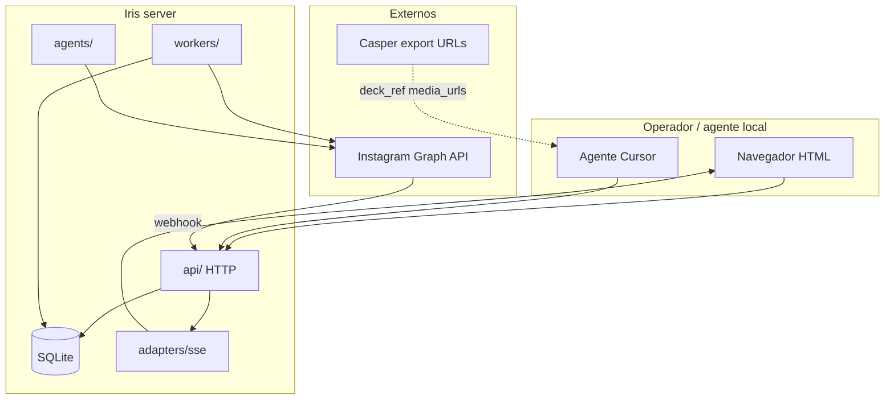

# 05 — Architecture

## Objective

Este documento define a forma do Iris: mini-server Node com camadas SRP, SQLite, UI HTML e integração Meta. Detalhes de schema e endpoints estão em `06` e `07`; fluxos Meta em `docs/architecture/meta-integration.md`.

## System context



**Repository layout:**

```txt
iris/
  src/
    domain/
    ports/
    adapters/sqlite/
    adapters/meta/
    adapters/sse/
    api/
    workers/
    agents/
    server.ts
  public/           # index.html, app.js, style.css
  migrations/
  docs/
  .agent/
  data/             # iris.db (gitignored)
```

## Layers and boundaries

| Layer | Responsibility | Paths | Depends on |
| ----- | -------------- | ----- | ---------- |
| Domain | Entidades, validações, transições de status | `src/domain/` | — |
| Ports | Interfaces de repositório e serviços externos | `src/ports/` | domain |
| Adapters | SQLite, Meta API, SSE | `src/adapters/` | ports, domain |
| API | Rotas HTTP, auth, DTO | `src/api/` | ports, adapters |
| Workers | Scheduler publish, comment responder | `src/workers/` | ports, adapters, agents |
| Agents | Prompt + LLM para respostas | `src/agents/` | ports |

## Major components

| Component | Purpose | Tech | Path |
| --------- | ------- | ---- | ---- |
| HTTP server | Bootstrap, routing, static files | `node:http` | `src/server.ts` |
| Post API | CRUD + schedule posts | REST JSON | `src/api/routes/posts.ts` |
| Comments API | List comments, manual reply | REST JSON | `src/api/routes/comments.ts` |
| Events API | SSE stream | `text/event-stream` | `src/api/routes/events.ts` |
| Meta webhook | Verify + ingest comments | HMAC | `src/api/routes/webhooks/meta.ts` |
| Publish worker | Due posts → Graph API | setInterval 60s | `src/workers/publish-scheduler.ts` |
| Reply worker | Trigger → agent → Meta reply | event-driven | `src/workers/comment-responder.ts` |
| Admin UI | Calendário/lista posts + comments | static HTML | `public/` |

## Integration points

| System | Direction | Protocol | Auth | On failure |
| ------ | --------- | -------- | ---- | ---------- |
| Instagram Graph API | Outbound | HTTPS REST | Page access token | Post → `failed`, log error |
| Meta webhooks | Inbound | HTTPS POST | HMAC signature | 401 reject; 200 ack on duplicate |
| Casper | Reference only | — | — | Operador cola URLs manualmente ou via agente |
| LLM provider | Outbound | HTTPS | API key in env | `reply_failed`, retry manual |

## Key flows

### 1 — Operador agenda postagem

1. Operador abre `http://host:8792/`
2. UI `GET /api/posts` (load inicial)
3. UI abre SSE `GET /api/events`
4. Operador cria post: caption, `scheduled_at`, `media_urls`, `deck_ref`
5. `POST /api/posts` → SQLite `status=scheduled`
6. Server `broadcast('posts-changed')` → UI refetch

### 2 — Publicação programada

1. `publish-scheduler` tick: `SELECT` posts `scheduled` com `scheduled_at <= now()`
2. `MetaPublisher` upload containers + publish (ou `scheduled_publish_time`)
3. Sucesso: `ig_media_id`, `status=published`
4. Falha: `status=failed`, `error_message`
5. SSE notifica UI

### 3 — Comentário + resposta automática

1. Meta `POST /webhooks/meta` → valida assinatura
2. Persiste em `comments` (`status=pending`)
3. SSE → UI mostra comentário
4. `comment-responder` (se auto-reply on): agent gera texto → `MetaComments.reply`
5. `comment_replies.status=sent`, `agent_runs` audit

### 4 — Agente Cursor cria post

1. Agente com `IRIS_AGENT_TOKEN` chama `POST /api/posts`
2. Mesmo fluxo que operador; sem acesso a Meta token

## Architecture detail files

| File | Topic |
| ---- | ----- |
| `docs/architecture/meta-integration.md` | Graph API, webhooks, permissões |
| `docs/architecture/srp-modules.md` | Mapa de módulos e dependências |

## Cross-cutting concerns

| Concern | Owner doc |
| ------- | --------- |
| Auth | `02_security.md` |
| Logging | structured stdout; sem PII em prod |
| Migrations | `06_database.md` |
| Env vars | `08_environments.md` |

## Gaps

| Gap | Blocks |
| --- | ------ |
| Host produção não escolhido | deploy v1-S4 |
| Conta Meta app não provisionada | EPIC-4 |
