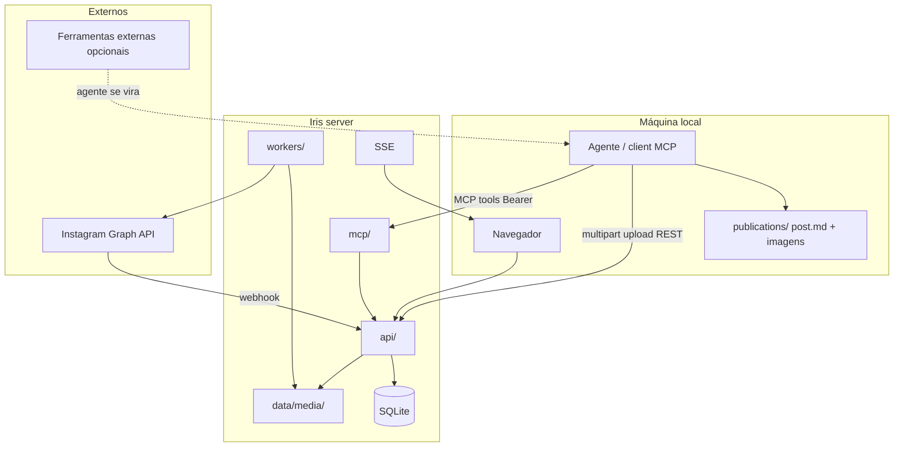

# 05 — Architecture

## Objective

Forma do Iris: mini-server com camadas SRP, mídia em disco, SQLite, UI HTML, Meta API. Pacote local do agente em `iris-agent/publications/` — ver `docs/architecture/local-publications.md`.

## System context



**Repository layout:**

```txt
iris/                     # workspace Meridian
  docs/                   # phase docs do produto
  .meridian/              # backlog SQLite
  iris-app/               # aplicação Node (server + UI)
    src/
      domain/
      ports/
      adapters/sqlite/
      adapters/media-storage/
      adapters/meta/
      adapters/sse/
      api/
      mcp/                # servidor MCP (Streamable HTTP)
      workers/
      agents/             # LLM reply no server
      server.ts
    public/               # UI HTML
    migrations/
    data/
      iris.db
      media/{post_id}/
  iris-agent/             # kit agente local (portável, sem Node)
    .agent/               # skills + agents Meridian
    publications/         # post.md + imagens
    iris.credentials.json
  .agent/                 # kit Meridian do produto (symlink push-publication → iris-agent)
```

## Layers and boundaries

| Layer | Responsibility | Paths |
| ----- | -------------- | ----- |
| Domain | Post, asset, status, schedule rules | `src/domain/` |
| Ports | Repositories, MediaStorage, MetaPublisher | `src/ports/` |
| Adapters | SQLite, filesystem media, Meta, SSE | `src/adapters/` |
| API | REST + multipart + MCP transport | `src/api/`, `src/mcp/` |
| Workers | publish-scheduler, comment-responder | `src/workers/` |

## Major components

| Component | Purpose | Path |
| --------- | ------- | ---- |
| MCP gateway | Streamable HTTP + tools editoriais | `src/mcp/` |
| Post API | CRUD + schedule | `src/api/routes/posts.ts` |
| Assets API | Multipart upload + serve | `src/api/routes/assets.ts` |
| Comments API | List + manual reply | `src/api/routes/comments.ts` |
| Events API | SSE | `src/api/routes/events.ts` |
| Media storage | `data/media/{post_id}/` | `src/adapters/media-storage/` |
| Image optimizer | Resize + JPEG no ingest | `src/adapters/image-optimizer/` |
| Publish worker | Lê disco → Meta | `src/workers/publish-scheduler.ts` |
| Admin UI (React SPA) | Operador editorial — calendário, kanban, comentários | `admin/src/` → build `public/` |

## Integration points

| System | Direction | Notes |
| ------ | --------- | ----- |
| Instagram Graph API | Outbound publish/reply | Token no server |
| Meta webhooks | Inbound comments | HMAC |
| Ferramentas externas / clients MCP | Inbound tools ou REST | Cursor, ChatGPT, Claude — ver `mcp-integration.md` |

## Key flows

### 1 — Agente local faz push

1. Lê `publications/{slug}/post.md` (`status: ready`)
2. `POST /api/posts` → `post_id`
3. `POST /api/posts/:id/assets` para cada imagem (multipart)
4. `PATCH` → `scheduled` se `scheduled_at` definido
5. Atualiza `post.md` com `iris_post_id`, `pushed_at`

### 2 — Operador pela UI

1. Cria post, faz upload de imagens na UI (mesmos endpoints)
2. Agenda horário → SSE atualiza lista

### 3 — Publicação programada

1. Worker: posts `scheduled` due + assets no disco
2. MetaPublisher upload + publish
3. `published` + `ig_media_id` ou `failed`

### 4 — Comentários

Webhook → `comments` → SSE → UI; worker auto-reply se habilitado.

**Agente de respostas (v1.10):** gates globais (`auto_reply_enabled`) e por post (`reply_mode`) → `process-comment-reply` → harness em 3 estágios (triagem, rascunho, verificação) com conteúdo editorial em `data/agent/*.md` → barreiras `crisis` / `hate_violence` (`barrier_reply`: triage LLM classifica; barrier LLM escreve sob checklist — CVV 188 se `pt-BR`; sem texto canned) → `agent_runs` + `agent_run_steps` → draft local ou publicação Meta → UI inspeciona via `GET /api/comments/:id/reply-audit`.

Diagramas: ver § Architecture diagrams (`iris-reply-agent-*`).

**Campanhas interativas (v1.29):** `agent_active_days` limita respostas a N dias após publicação do post; `private_reply_mode` envia DM via Meta private reply (`recipient.comment_id`) após comentário — ver [post-campaign-agent-private-reply.md](architecture/post-campaign-agent-private-reply.md).

### 5 — Mensagens Instagram (DM)

Webhook `messaging` → `conversations` + `messages` → SSE `messages-changed` → UI `/messages`; worker `message-responder` se `message_reply_mode` habilitado.

**Message harness (v1.18):** pipeline separado (`message_triage` → `message_draft` → `message_verify`) com `message_agent_content` e catálogo `products`. Regras Meta: janela 24h (`can_reply`) e Page vinculada (`messaging_supported`).

Diagramas: `iris-message-reply-flow.md`, `iris-message-harness.md`.

### 7 — Lojas virtuais (v1.19)

Conexão com catálogos externos (Yampi primeiro) via **port/adapter** (`StoreProvider`), sync unidirecional para `product_store_links` e merge de campos em `ProductFieldResolver` → `ResolvedProductView`.

O message-harness DM (`build-prompts.ts`, `message-reply-context-assembler.ts`) consome a view resolvida — só campos com `source` ativo (Iris, loja ou desativado por política global/per-product).

Detalhe: `docs/architecture/ecommerce-stores.md`.

### 6 — Cliente MCP (ad hoc)

1. Client envia `POST /mcp` com `Authorization: Bearer <IRIS_MCP_CONNECTION_CODE>`
2. Handshake MCP → `tools/list` expõe operações editoriais
3. Tool invoca use-cases equivalentes ao REST agent (posts, comments); assets via prepare + `POST /upload/assets/...` multipart (sem base64 no MCP)

Ver `docs/architecture/mcp-integration.md` para setup por client.

## Architecture diagrams

Diagramas Mermaid para o viewer **Meridian: Open Architecture Diagram** (`docs/architecture/diagrams/`).

| File | Kind | Scope |
| ---- | ---- | ----- |
| `architecture/diagrams/iris-reply-agent-flow.md` | flow | Sequência webhook/worker/simulador → gates → harness v2 → draft/Meta → audit UI |
| `architecture/diagrams/iris-reply-agent-runtime.md` | runtime | Módulos, carousel_summary, response_language, output_json, simulador e SQLite |
| `architecture/diagrams/iris-reply-agent-harness.md` | flow | Estados terminais: replyTier, blocked_harmful, barrier_reply, light/full verify |
| `architecture/diagrams/iris-message-reply-flow.md` | flow | Webhook/worker DM → message-harness → draft/Meta → audit |
| `architecture/diagrams/iris-message-harness.md` | flow | Estágios message_triage / draft / verify e categorias |
| `architecture/diagrams/iris-admin-demo-mode.md` | runtime | Landing → `/demo` isolado, `demoApiFetch`, fixtures PT/EN, sem API real |

## Architecture detail files

| File | Topic |
| ---- | ----- |
| `docs/architecture/mcp-integration.md` | MCP — Cursor, ChatGPT, Claude, validate, tools |
| `docs/architecture/ecommerce-stores.md` | Lojas virtuais — port/adapter, sync, políticas de campo, Yampi |
| `docs/architecture/image-optimization.md` | Pipeline sharp, limites, env |
| `docs/meta/README.md` | Guias passo a passo Meta / Instagram (01–08) |
| `docs/meta/referencia-tecnica.md` | Graph API, webhooks — referência dev |
| `docs/meta/08-app-review.md` | Checklist revisão app Meta (IGIris) |
| `docs/architecture/srp-modules.md` | Módulos e dependências |
| `docs/architecture/admin-ui-layout.md` | Admin React — shell persistente, `PageContainer`, providers |
| `docs/architecture/admin-demo-mode.md` | Demo público `/demo` — fixtures client-side, isolamento de sessão |
| `docs/architecture/i18n.md` | i18n PT/EN — domínios, provider admin, erros API, email |
| `docs/architecture/docs-site.md` | Site Starlight — guias Meta públicos PT/EN, build e deploy |

## Internacionalização

Admin React, landing, demo e mensagens user-facing da API seguem o modelo em `docs/architecture/i18n.md`: locales `pt`/`en`, traduções por domínio tipado, erros com código estável traduzidos no client, emails transacionais por locale. Implementação: EPIC-17 / v1.20.

## Gaps

| Gap | Blocks |
| --- | ------ |
| Host produção | deploy v1-S4 |
| App Meta | EPIC-4 |
