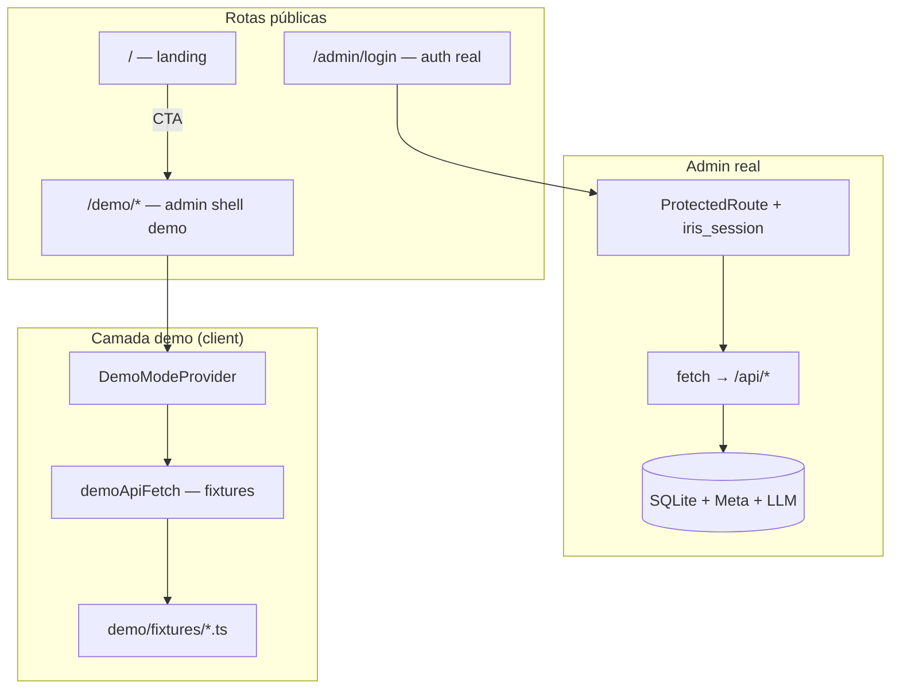

# Admin demo mode

## Objetivo

Oferecer uma **demonstração pública e interativa** do admin Iris em `/demo`, reutilizando as mesmas páginas e componentes do ambiente real, mas alimentadas por **fixtures locais no client**. O visitante explora calendário, comentários, webhooks, execuções do agente, settings e simulador **sem login**, **sem cookie de sessão admin** e **sem chamadas à API real**.

## Princípios

| Princípio | Regra |
| --------- | ----- |
| Isolamento | Demo e admin real são fluxos separados; `/demo` nunca autentica nem herda `iris_session` |
| Client-only (v1.17) | Fixtures e interceptação em `api.ts`; nenhum endpoint `/api/demo/*` no server nesta versão |
| Read-only efetivo | Mutações retornam sucesso simulado ou toast “modo demonstração”; nada persiste |
| Sem integrações externas | Sem Meta, LLM, MCP, SSE real ou upload para o server |
| Reuso máximo | Mesmas pages (`DashboardPage`, `CommentsPage`, …) sob `DemoModeProvider` |
| Transparência | Banner fixo: “Modo demonstração — explore o Iris com dados fictícios, sem cadastro.” |

## Arquitetura



## Rotas

| Rota | Auth | Comportamento |
| ---- | ---- | ------------- |
| `/demo` | Nenhuma | Dashboard com fixtures |
| `/demo/comments` | Nenhuma | Inbox e threads fictícias |
| `/demo/webhooks` | Nenhuma | Lista de eventos fake |
| `/demo/agent-runs` | Nenhuma | Execuções fictícias |
| `/demo/agent-simulator` | Nenhuma | Respostas pré-gravadas (sem LLM) |
| `/demo/settings` | Nenhuma | Formulários preenchidos, read-only efetivo |
| `/demo/persona` | Nenhuma | Persona e conteúdo editorial fake |
| `/admin/*` | OTP + cookie | Inalterado |

`ROUTES.demo.*` espelha `ROUTES.admin.*` com prefixo `/demo`. Links internos no shell demo usam o prefixo demo (sidebar, navegação).

## Componentes (admin)

```txt
iris-app/admin/src/
  demo/
    demo-mode-context.tsx       # isDemoMode, banner, guards de UI
    demo-api.ts                 # roteamento path → fixture / noop
    demo-routes.ts              # prefixo /demo, helpers de path
    fixtures/
      posts.ts
      comments.ts
      webhooks.ts
      agent-runs.ts
      settings.ts
      persona.ts
      meta-status.ts
      simulator.ts
  pages/
    demo-shell.tsx              # AppLayout sem ProtectedRoute (opcional wrapper)
```

### DemoModeProvider

- Define `isDemoMode = true` via React context.
- Renderiza banner não dismissable no topo do `AppLayout`.
- Desabilita `subscribeRealtimeEvents` (retorna cleanup noop).
- Expõe helper `demoToast()` para ações bloqueadas.

### Interceptação de API

`getDemoMode()` é **síncrono**: considera a rota `/demo` (via `isDemoPath()`) antes do primeiro paint — evita race com `useEffect` do provider. `apiFetch` em `lib/api.ts` verifica `getDemoMode()` **antes** de `fetch`:

1. **GET** — `demoApiFetch` resolve fixture por path + query.
2. **POST/PATCH/DELETE** — retorna payload de sucesso mínimo ou lança toast; **nunca** chama o server.
3. **Upload (`FormData`)** — retorna asset fake com `URL.createObjectURL(file)` para preview local.
4. **Blob de mídia** — fixtures usam URLs estáticas em `public/demo-media/` ou placeholders.

Registry em `demo-api.ts` mapeia padrões de path (`/api/posts`, `/api/comments/inbox`, …) para handlers. Handlers retornam tipos de `@/lib/types`.

## Segurança

| Risco | Mitigação |
| ----- | --------- |
| Vazamento de sessão admin | `/demo` fora de `ProtectedRoute`; sem `credentials` em demo (ou credentials ignoradas — API não é chamada) |
| Bypass do mock via DevTools | Aceitável para v1.17 — demo não expõe dados reais; quem tem sessão admin já tem acesso |
| Chamada acidental à API real | Branch no início de `apiFetch`; testes manuais com Network tab vazio em `/demo` |
| LLM / Meta no simulador | `simulateAgentReply` retorna fixture com delay simulado; sem `POST /api/agent/simulate` |
| Tokens no bundle | Proibido — fixtures são dados estáticos, sem secrets |
| Server SPA gate | `spa-route-policy.ts` trata `/demo` como rota pública (sem redirect para login) |

### O que o demo **não** faz

- Login OTP ou emissão de cookie
- CRUD real em SQLite
- Publicação ou resposta na Meta
- Geração ou revogação de connection code MCP
- Consumo de LLM (custo)
- SSE com eventos reais

## Fixtures — diretrizes de conteúdo

- Dados realistas em PT-BR (handles, legendas, comentários editoriais).
- Posts em múltiplos status: `draft`, `scheduled`, `published`, `monitored`.
- Pelo menos um carrossel com 3 assets e `user_tags` / `alt_text` de exemplo.
- Inbox com threads abertas, rascunho de IA pendente e comentário já respondido.
- Webhooks com `comment` e `mentions` nos últimos 7 dias fictícios.
- Agent runs com stages de triagem/verificação para o painel de audit.
- Meta status: “conectado (demonstração)” — sem botão funcional de disconnect.

## Landing

- CTA primário ou secundário “Ver demonstração” → `/demo`.
- Textos i18n em `landing/pt.ts` e `landing/en.ts`.
- Abre em mesma aba (não popup) para SEO e simplicidade.

## Testes

| Tipo | Escopo |
| ---- | ------ |
| Manual | Navegar todas as rotas `/demo/*`; Network sem `/api/*` (exceto assets estáticos) |
| Build | `pnpm build:admin` exit 0 |
| Opcional (futuro) | Unit test em `demo-api.ts` para path matching |

## Evolução futura (fora v1.17)

- API read-only `/api/demo/*` no server com rate limit (defesa em profundidade).
- Analytics de uso do demo.
- Tour guiado (shepherd.js ou similar).
- i18n do banner e fixtures EN.

## Referências

- `docs/02_security.md` — sessão e tokens
- `docs/architecture/admin-ui-layout.md` — shell e `PageContainer`
- `docs/03_user_types.md` — perfil Visitante demo
