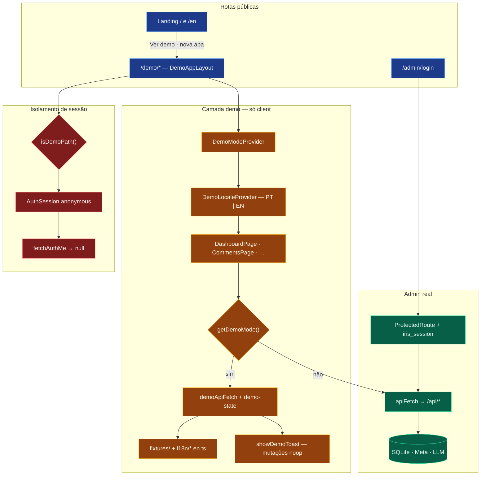

# Runtime — modo demonstração (`/demo`)

```mermaid
flowchart TB
  subgraph PUBLIC ["Rotas públicas"]
    LAND["Landing / e /en"]
    DEMO["/demo/* — DemoAppLayout"]
    LOGIN["/admin/login"]
  end

  subgraph REAL ["Admin real"]
    PROT["ProtectedRoute + iris_session"]
    API["apiFetch → /api/*"]
    DB[("SQLite · Meta · LLM")]
  end

  subgraph DEMO_LAYER ["Camada demo — só client"]
    DMP["DemoModeProvider"]
    DLP["DemoLocaleProvider — PT | EN"]
    PAGES["DashboardPage · CommentsPage · …"]
    BRANCH{"getDemoMode()"}
    MOCK["demoApiFetch + demo-state"]
    FIX["fixtures/ + i18n/*.en.ts"]
    TOAST["showDemoToast — mutações noop"]
  end

  subgraph AUTH ["Isolamento de sessão"]
    PATH{"isDemoPath()"}
    ANON["AuthSession anonymous"]
    NOME["fetchAuthMe → null"]
  end

  LAND -->|Ver demo · nova aba| DEMO
  DEMO --> DMP --> DLP --> PAGES
  PAGES --> BRANCH
  BRANCH -->|sim| MOCK
  BRANCH -->|não| API
  MOCK --> FIX
  MOCK --> TOAST

  DEMO --> PATH
  PATH --> ANON
  ANON --> NOME

  LOGIN --> PROT --> API --> DB

  classDef public fill:#1e3a8a,stroke:#60a5fa,color:#eff6ff
  classDef real fill:#065f46,stroke:#34d399,color:#ecfdf5
  classDef demo fill:#92400e,stroke:#fbbf24,color:#fffbeb
  classDef guard fill:#7f1d1d,stroke:#f87171,color:#fef2f2

  class LAND,DEMO,LOGIN public
  class PROT,API,DB real
  class DMP,DLP,PAGES,BRANCH,MOCK,FIX,TOAST demo
  class PATH,ANON,NOME guard
```
