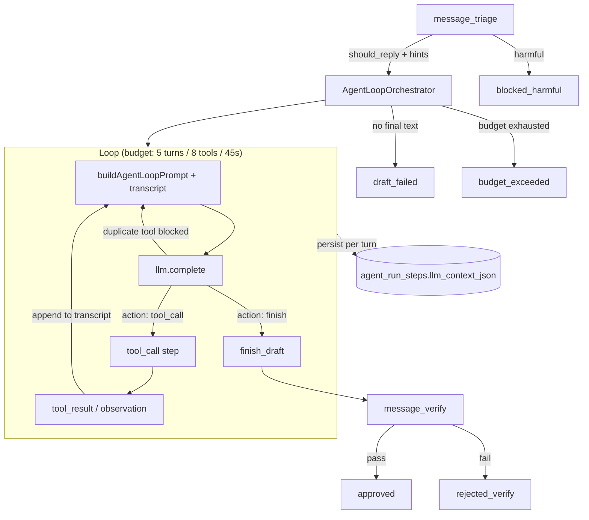

# Harness agentic — loop ReAct

## Observações entre turnos

| Etapa | Persistência | Conteúdo |
| ----- | ------------ | -------- |
| Turno LLM | `message_draft_turn` + `llm_context_json` | prompt base + transcript ReAct enviado ao modelo |
| Tool | `tool_call` / `tool_result` | nome, args, output sanitizado |
| Sessão | `session_summary_json` | tokens, duração, contagens |

## Status terminais DM

| Status | Quando |
| ------ | ------ |
| `approved` | verify passou com texto final |
| `draft_failed` | loop não produziu texto (sem verify) |
| `budget_exceeded` | turnos/tools/timeout esgotados |
| `rejected_verify` | verify rodou e barrou |
| `blocked_harmful` | triagem bloqueou |
