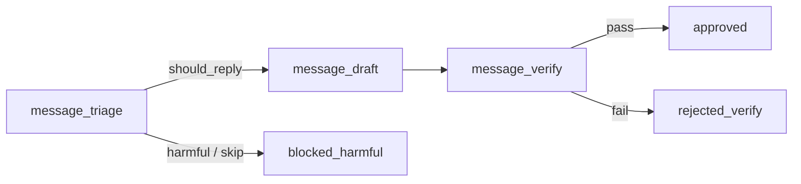

# Message harness (DM)

Pipeline de IA para DMs Instagram — independente do comment reply harness.

## Estágios

| Stage | Entrada | Saída |
| ----- | ------- | ----- |
| `message_triage` | thread DM, `dm_restrictions`, produtos ativos | `messageCategory`, `product_slug` opcional |
| `message_draft` | `dm_soul`, `dm_page`, `dm_knowledge`, persona global | texto da resposta |
| `message_verify` | restrições + limite de caracteres | pass / fail |

## Categorias (triagem)

`product_inquiry`, `order_support`, `appreciation`, `general_question`, `spam`, `harmful`.

## Conteúdo editorial

- Persona global (`reply_persona`): idioma, assinatura, `max_chars`.
- Blocos DM (`message_agent_content`): `dm_soul`, `dm_page`, `dm_knowledge`, `dm_restrictions`.
- Catálogo (`products`): injetado quando triagem detecta `product_inquiry`.
