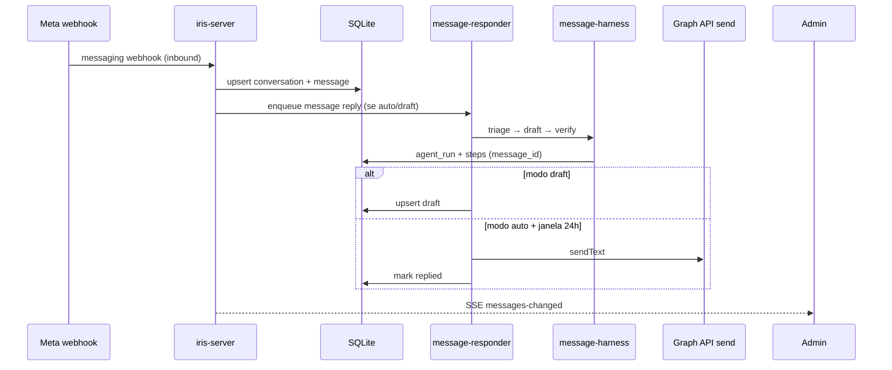

# Fluxo de resposta a DMs Instagram

Segundo harness de mensagens (v1.18), separado do fluxo de comentários.

## Pontos de entrada

| Entrada | Descrição |
| ------- | --------- |
| Webhook `messaging` | Ingestão inbound; enfileira worker conforme settings |
| `POST /api/messages/:id/ai-reply` | Geração manual (auto ou draft) |
| `POST /api/messages/:id/approve-reply` | Aprova rascunho e envia |
| `POST /api/messages/:id/reply` | Resposta manual do operador |
| `POST /api/agent/simulate` (`channel=dm`) | Sandbox sem Meta |

## Regras Meta

- Resposta só dentro da **janela de 24h** após a última mensagem inbound (`can_reply`).
- Conta precisa de **Page vinculada** (`messaging_supported` em `/api/meta/status`).
