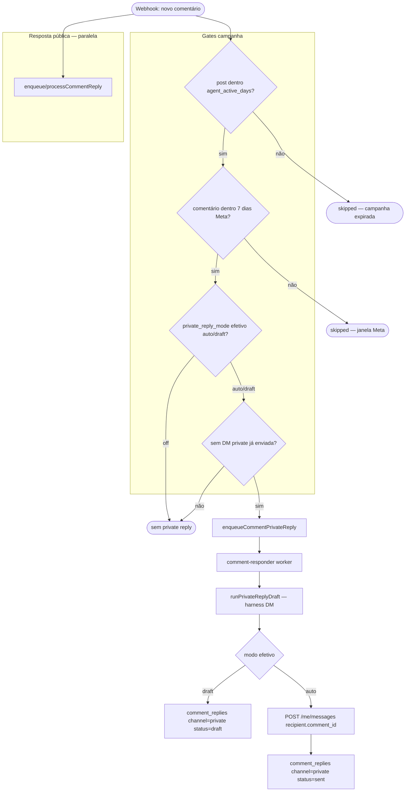

# Fluxo campanha interativa + private reply

```mermaid
flowchart TB
  WH([Webhook: novo comentário])

  subgraph GATES ["Gates campanha"]
    G1{post dentro agent_active_days?}
    G2{comentário dentro 7 dias Meta?}
    G3{private_reply_mode efetivo auto/draft?}
    G4{sem DM private já enviada?}
  end

  WH --> G1
  G1 -->|não| SKIP([skipped — campanha expirada])
  G1 -->|sim| G2
  G2 -->|não| SKIP2([skipped — janela Meta])
  G2 -->|sim| G3
  G3 -->|off| STOP([sem private reply])
  G3 -->|auto/draft| G4
  G4 -->|sim| ENQ["enqueueCommentPrivateReply"]
  G4 -->|não| STOP

  ENQ --> WRK["comment-responder worker"]
  WRK --> HARNESS["runPrivateReplyDraft — harness DM"]
  HARNESS --> MODE{modo efetivo}

  MODE -->|draft| DRAFT["comment_replies channel=private status=draft"]
  MODE -->|auto| META["POST /me/messages recipient.comment_id"]
  META --> SENT["comment_replies channel=private status=sent"]

  subgraph PUBLIC ["Resposta pública — paralela"]
    PUB["enqueue/processCommentReply"]
  end

  WH --> PUB
```

Ver também: [post-campaign-agent-private-reply.md](../post-campaign-agent-private-reply.md).
