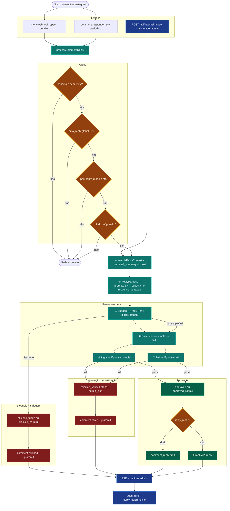

# Fluxo do agente de respostas automáticas

```mermaid
flowchart TB
  START([Novo comentário Instagram])

  subgraph IN ["Entrada"]
    WH["meta-webhook: upsert pending"]
    WRK["comment-responder: tick periódico"]
    SIM["POST /api/agent/simulate — simulador admin"]
  end

  PCR["processCommentReply"]

  subgraph GATES ["Gates"]
    G1{pending e sem reply?}
    G2{auto_reply global ON?}
    G3{post reply_mode ≠ off?}
    G4{LLM configurado?}
  end

  STOP([Nada acontece])

  CTX["assembleReplyContext + carousel_summary do post"]
  HARNESS["runReplyHarness — prompts EN · resposta no response_language"]

  subgraph STAGES ["Harness — tiers"]
    S1["① Triagem — replyTier + blockCategory"]
    S2["② Rascunho — simple ou full"]
    S3S["③ Light verify — tier simple"]
    S3F["③ Full verify — tier full"]
    S1 --> S2
    S2 --> S3S
    S2 --> S3F
  end

  subgraph OUT_SKIP ["Bloqueio na triagem"]
    OS1["skipped_triage ou blocked_harmful"]
    OS2["comment skipped · guardrail"]
  end

  subgraph OUT_FAIL ["Reprovação na verificação"]
    OF1["rejected_verify + steps + output_json"]
    OF2["comment failed · guardrail"]
  end

  subgraph OUT_OK ["Aprovado"]
    OK1["approved ou approved_simple"]
    OK2{reply_mode?}
    OK3["comment_reply draft"]
    OK4["Graph API reply"]
  end

  UI["SSE + páginas admin"]
  AUD["agent-runs · ReplyAuditTimeline"]

  START --> WH
  START --> WRK
  WH --> PCR
  WRK --> PCR
  SIM --> CTX

  PCR --> G1
  G1 -->|não| STOP
  G1 -->|sim| G2
  G2 -->|não| STOP
  G2 -->|sim| G3
  G3 -->|não| STOP
  G3 -->|sim| G4
  G4 -->|não| STOP
  G4 -->|sim| CTX

  CTX --> HARNESS
  HARNESS --> S1

  S1 -->|tier none| OS1 --> OS2
  S1 -->|tier simple/full| S2
  S3S -->|fail| OF1 --> OF2
  S3F -->|fail| OF1
  S3S -->|pass| OK1
  S3F -->|pass| OK1
  OK1 --> OK2
  OK2 -->|draft| OK3
  OK2 -->|auto| OK4

  OS2 --> UI
  OF2 --> UI
  OK3 --> UI
  OK4 --> UI
  UI --> AUD

  classDef gate fill:#92400e,stroke:#fbbf24,color:#fffbeb
  classDef stage fill:#0f766e,stroke:#2dd4bf,color:#ecfeff
  classDef block fill:#7f1d1d,stroke:#f87171,color:#fef2f2
  classDef ok fill:#065f46,stroke:#34d399,color:#ecfdf5
  classDef ui fill:#1e3a8a,stroke:#60a5fa,color:#eff6ff

  class G1,G2,G3,G4,OK2 gate
  class S1,S2,S3S,S3F,PCR,CTX,HARNESS stage
  class OS1,OS2,OF1,OF2 block
  class OK1,OK3,OK4 ok
  class UI,AUD,SIM ui
```
