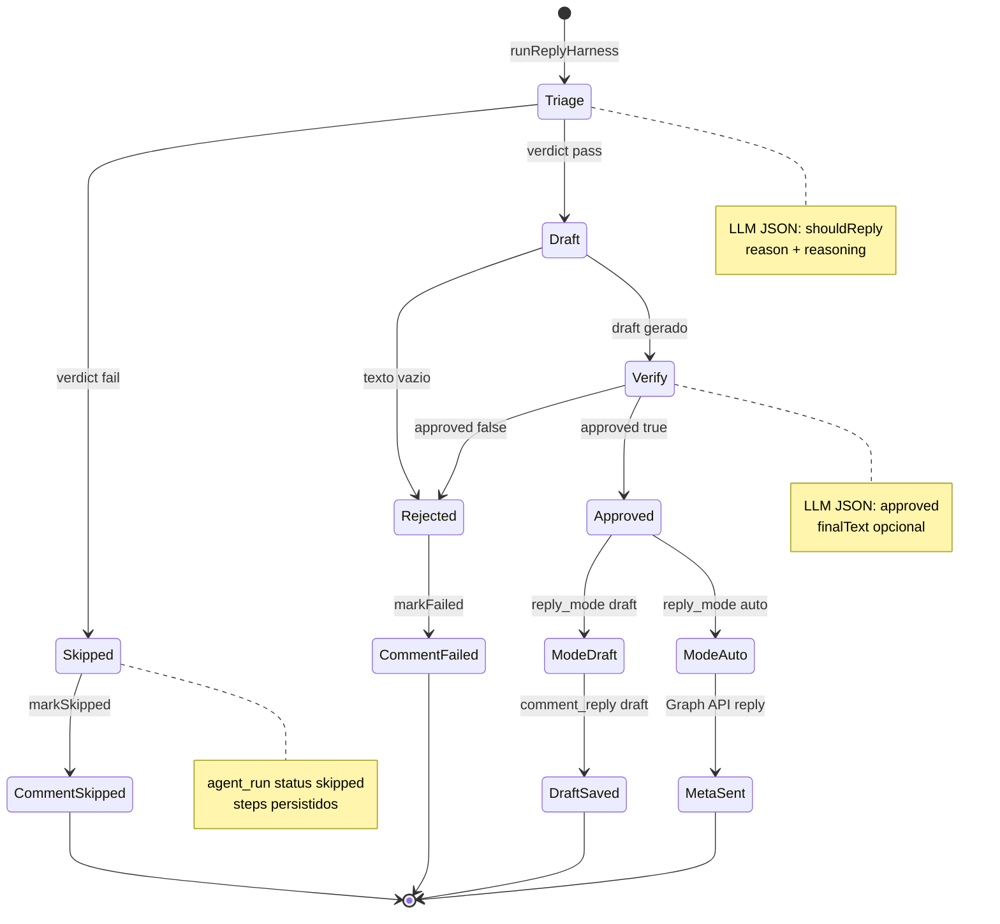

# Harness — máquina de estados

```mermaid
stateDiagram-v2
  direction TB

  [*] --> Triage: runReplyHarness

  Triage --> Skipped: verdict fail
  Triage --> Draft: verdict pass

  Draft --> Rejected: texto vazio
  Draft --> Verify: draft gerado

  Verify --> Rejected: approved false
  Verify --> Approved: approved true

  Skipped --> CommentSkipped: markSkipped
  Rejected --> CommentFailed: markFailed
  Approved --> ModeDraft: reply_mode draft
  Approved --> ModeAuto: reply_mode auto

  ModeDraft --> DraftSaved: comment_reply draft
  ModeAuto --> MetaSent: Graph API reply

  CommentSkipped --> [*]
  CommentFailed --> [*]
  DraftSaved --> [*]
  MetaSent --> [*]

  note right of Triage
    LLM JSON: shouldReply
    reason + reasoning
  end note

  note right of Verify
    LLM JSON: approved
    finalText opcional
  end note

  note right of Skipped
    agent_run status skipped
    steps persistidos
  end note
```
