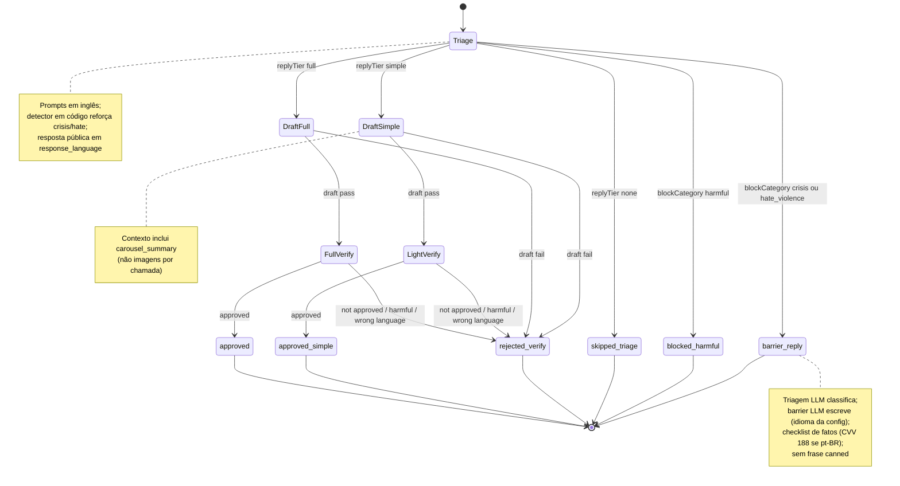

# Harness — estados terminais

```mermaid
stateDiagram-v2
  [*] --> Triage

  Triage --> barrier_reply: blockCategory crisis ou hate_violence
  Triage --> blocked_harmful: blockCategory harmful
  Triage --> skipped_triage: replyTier none
  Triage --> DraftSimple: replyTier simple
  Triage --> DraftFull: replyTier full

  DraftSimple --> rejected_verify: draft fail
  DraftFull --> rejected_verify: draft fail

  DraftSimple --> LightVerify: draft pass
  DraftFull --> FullVerify: draft pass

  LightVerify --> rejected_verify: not approved / harmful / wrong language
  LightVerify --> approved_simple: approved

  FullVerify --> rejected_verify: not approved / harmful / wrong language
  FullVerify --> approved: approved

  barrier_reply --> [*]
  blocked_harmful --> [*]
  skipped_triage --> [*]
  rejected_verify --> [*]
  approved_simple --> [*]
  approved --> [*]

  note right of Triage
    Prompts em inglês;
    detector em código reforça crisis/hate;
    resposta pública em response_language
  end note

  note right of barrier_reply
    Triagem LLM classifica;
    barrier LLM escreve (idioma da config);
    checklist de fatos (CVV 188 se pt-BR);
    sem frase canned
  end note

  note right of DraftSimple
    Contexto inclui carousel_summary
    (não imagens por chamada)
  end note
```
