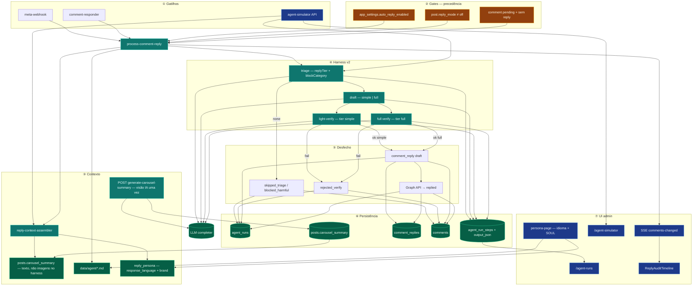

# Runtime — agente de comentários

```mermaid
flowchart TB
  subgraph L1 ["① Gatilhos"]
    WH["meta-webhook"]
    WRK["comment-responder"]
    SIM["agent-simulator API"]
  end

  subgraph L2 ["② Gates — precedência"]
    G1["app_settings.auto_reply_enabled"]
    G2["post.reply_mode ≠ off"]
    G3["comment pending + sem reply"]
  end

  PCR["process-comment-reply"]

  subgraph L3 ["③ Contexto"]
    RCA["reply-context-assembler"]
    CS["posts.carousel_summary — texto, não imagens no harness"]
    GEN["POST generate-carousel-summary — visão IA uma vez"]
    FS["data/agent/*.md"]
    RP["reply_persona — response_language + brand"]
  end

  subgraph L4 ["④ Harness v2"]
    T["triage — replyTier + blockCategory"]
    D["draft — simple | full"]
    LV["light-verify — tier simple"]
    V["full verify — tier full"]
    T --> D
    D --> LV
    D --> V
  end

  LLM[("LLM completer")]

  subgraph L5 ["⑤ Desfecho"]
    SK["skipped_triage / blocked_harmful"]
    FL["rejected_verify"]
    DR["comment_reply draft"]
    AU["Graph API → replied"]
  end

  subgraph L6 ["⑥ Persistência"]
    AR[("agent_runs")]
    ARS[("agent_run_steps + output_json")]
    CR[("comment_replies")]
    CMT[("comments")]
    PST[("posts.carousel_summary")]
  end

  subgraph L7 ["⑦ UI admin"]
    SSE["SSE comments-changed"]
    RUNS["/agent-runs"]
    SIMUI["/agent-simulator"]
    AUD["ReplyAuditTimeline"]
    PER["persona-page — idioma + SOUL"]
  end

  WH --> PCR
  WRK --> PCR
  SIM --> RCA
  G1 --> PCR
  G2 --> PCR
  G3 --> PCR

  PCR --> RCA
  PCR --> FS
  RCA --> RP
  RCA --> CS
  GEN --> PST
  PST --> CS
  PCR --> T
  SIM --> T

  T --> LLM
  D --> LLM
  LV --> LLM
  V --> LLM
  GEN --> LLM

  T -->|none| SK
  LV -->|fail| FL
  V -->|fail| FL
  LV -->|ok simple| DR
  V -->|ok full| DR
  DR --> AU

  SK & FL & DR & AU --> AR
  T & D & LV & V --> ARS
  DR & AU --> CR
  SK & FL & DR & AU --> CMT

  PCR --> SSE
  SSE --> AUD
  ARS --> RUNS
  SIM --> SIMUI
  PER --> RP
  PER --> FS

  classDef module fill:#0f766e,stroke:#2dd4bf,color:#ecfeff
  classDef store fill:#065f46,stroke:#34d399,color:#ecfdf5
  classDef gate fill:#92400e,stroke:#fbbf24,color:#fffbeb
  classDef ui fill:#1e3a8a,stroke:#60a5fa,color:#eff6ff

  class PCR,RCA,T,D,LV,V,GEN module
  class CMT,AR,ARS,CR,FS,RP,LLM,PST,CS store
  class G1,G2,G3 gate
  class SSE,AUD,RUNS,SIMUI,PER,SIM ui
```
