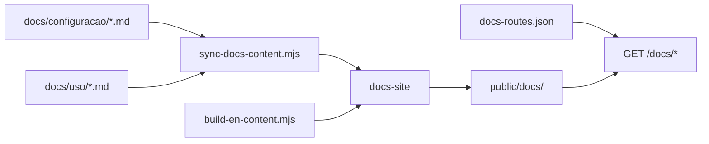

# Docs site — Starlight PT/EN em `/docs`

## Objective

Documentação pública para operadores e deployers, **no mesmo host do Iris** em `/docs/` — sem subdomínio, sem porta extra, sem deploy separado.

## Package e saída

| Item | Path |
| ---- | ---- |
| Fonte (Starlight) | `iris-app/docs-site/` |
| Build output | `iris-app/public/docs/` |
| URL pública | `{IRIS_PUBLIC_BASE_URL}/docs/` |
| Config Astro | `base: "/docs"`, `outDir: "../public/docs"` |

## HTTP

O `http-server` serve `public/docs/` para `/docs/*`. Redirects vêm de `docs-site/docs-routes.json` (runtime + stubs estáticos).

## Locales

| Locale | URL prefix | Content path |
| ------ | ---------- | -------------- |
| Português (default) | `/docs/` | `src/content/docs/` |
| English | `/docs/en/` | `src/content/docs/en/` |

## Content sources



## Commands

From `iris-app/`:

```bash
pnpm docs:build    # → public/docs/
pnpm build:admin   # admin + docs
```

Dev: após `pnpm docs:build`, acesse `http://127.0.0.1:8792/docs/` com `pnpm dev`.

## Related

- `docs/configuracao/README.md` — configuração Meta
- `docs/uso/README.md` — guia de uso
- `docs/08_environments.md` — § Site de documentação
- EPIC-20 / v1.30
