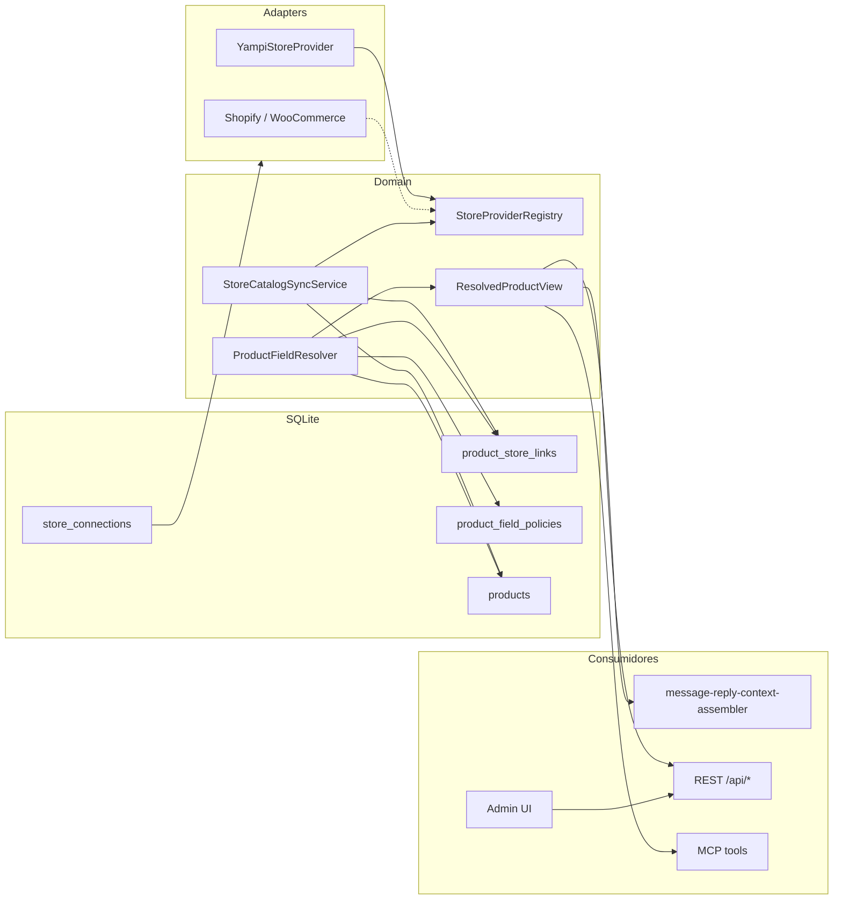

# Lojas virtuais — integração extensível (v1.19)

Conectar catálogos externos (Yampi primeiro; Shopify, WooCommerce depois) ao Iris sem duplicar lógica no message-harness, REST ou UI.

## Visão geral

O Iris mantém um cadastro editorial (`products`) usado na triagem DM (`product_inquiry`). Lojas virtuais são **fontes opcionais** de dados enriquecidos (preço, URL, descrições da plataforma). O operador controla, por conexão e por produto, quais campos entram no contexto do agente.



**Regras:**

| Camada | Responsabilidade |
| ------ | ---------------- |
| `ports/store-provider.ts` | Contrato por plataforma — sem HTTP no domain |
| `adapters/{yampi,shopify,...}/` | HTTP, auth, mapeamento → `ExternalProduct` |
| `domain/stores/store-provider-registry.ts` | Resolve `provider_type` → implementação |
| `domain/products/product-field-resolver.ts` | Único merge Iris + snapshot + políticas |
| `adapters/sqlite/*-repository.ts` | Persistência |

## Persistência

### `store_connections`

| Coluna | Tipo | Notas |
| ------ | ---- | ----- |
| `id` | TEXT PK | UUID |
| `provider_type` | TEXT | `yampi`, `shopify`, `woocommerce` |
| `label` | TEXT | Nome amigável na UI |
| `status` | TEXT | `active`, `error`, `disconnected` |
| `settings_json` | TEXT | JSON — defaults de política, flags de sync |
| `encrypted_credentials` | TEXT | Blob AES-256-GCM (mesmo vault que tokens Meta/LLM) |
| `last_sync_at` | TEXT | ISO |
| `last_error` | TEXT | Último erro de test/sync |
| `created_at`, `updated_at` | TEXT | ISO |

### `product_store_links`

| Coluna | Tipo | Notas |
| ------ | ---- | ----- |
| `id` | TEXT PK | |
| `product_id` | TEXT FK → `products` | ON DELETE CASCADE |
| `store_connection_id` | TEXT FK → `store_connections` | ON DELETE CASCADE |
| `external_product_id` | TEXT | ID na plataforma |
| `external_sku` | TEXT | Opcional |
| `provider_snapshot_json` | TEXT | Último `ExternalProduct` serializado |
| `linked_at`, `updated_at` | TEXT | ISO |

Índices únicos: `(store_connection_id, external_product_id)` e `(product_id, store_connection_id)`.

### `product_field_policies`

| Coluna | Tipo | Notas |
| ------ | ---- | ----- |
| `id` | TEXT PK | |
| `scope` | TEXT | `global` \| `product` |
| `store_connection_id` | TEXT FK | |
| `product_id` | TEXT FK nullable | NULL quando `scope=global` |
| `field_key` | TEXT | Ver § Políticas de campo |
| `source` | TEXT | `iris` \| `store` \| `disabled` |
| `created_at`, `updated_at` | TEXT | |

## StoreProvider port

Arquivo: `iris-app/server/src/ports/store-provider.ts`

```typescript
type StoreProvider = {
  readonly providerType: StoreProviderType;
  testConnection(credentials: unknown): Promise<StoreConnectionTestResult>;
  listExternalProducts(
    credentials: unknown,
    options?: { page?: number; perPage?: number },
  ): Promise<ExternalProductPage>;
  getExternalProduct(
    credentials: unknown,
    externalProductId: string,
  ): Promise<ExternalProduct | null>;
};
```

`ExternalProduct` — campos comuns:

| Campo | Tipo | Uso |
| ----- | ---- | --- |
| `externalId` | string | ID na loja |
| `name` | string | |
| `shortDescription` | string | |
| `longDescription` | string | |
| `price` | string \| null | Formatado para prompt (ex. `R$ 99,90`) |
| `url` | string \| null | Link do produto na loja |
| `imageUrl` | string \| null | |
| `sku` | string \| null | |
| `raw` | Record<string, unknown> | Payload específico do provider |

Credenciais são **discriminated union** por `provider_type` (ex. Yampi: `alias`, `userToken`, `userSecretKey`).

Registry: `createStoreProviderRegistry()` — `register(provider)`, `get(type)`, erro explícito para tipo não implementado.

## Políticas de campo

Chaves suportadas (`ProductFieldKey`): `name`, `short_description`, `long_description`, `price`, `url`, `image_url`, `sku`.

| `source` | Comportamento |
| -------- | ------------- |
| `iris` | Valor do cadastro Iris (`products`) |
| `store` | Valor do `provider_snapshot_json` do vínculo |
| `disabled` | Campo omitido do `ResolvedProductView` / prompt |

**Precedência:** política `scope=product` > `scope=global` (por `store_connection_id`) > default:

| Campo | Default sem política |
| ----- | -------------------- |
| `name`, `short_description`, `long_description` | `iris` |
| `price`, `url`, `image_url`, `sku` | `store` se snapshot existir; senão `iris` |

`ProductFieldResolver` (`domain/products/product-field-resolver.ts`) é a **única** função de merge — harness, REST preview e MCP devem reutilizá-la (DRY).

`ResolvedProductView` expõe valores finais + `fieldSources` por chave para auditoria na UI.

## Adapter Yampi

**v1.19:** autenticação **User Token** (`User-Token` + `User-Secret-Key` + `alias`) para loja própria — ver [docs Yampi](https://docs.yampi.com.br/auth/auth).

Implementação: `adapters/yampi/yampi-client.ts`, `yampi-store-provider.ts`, `yampi-product-mapper.ts`.

**Fora de v1.19:** OAuth 2.0 PKCE (Loja de Apps, multi-lojista).

## Fluxo de sync

`StoreCatalogSyncService` (US-0187):

1. Carrega conexão + descriptografa credenciais.
2. Resolve provider via registry.
3. Pagina `listExternalProducts`.
4. Para cada item: upsert `product_store_links` + `provider_snapshot_json`.
5. Modo `import_new`: cria `products` quando não há match (slug derivado do nome).
6. Atualiza `last_sync_at` / `last_error` na conexão.

Sync **unidirecional** (loja → Iris). Remoção na loja não apaga produto Iris — vínculo pode ficar stale (UI mostra aviso).

## UI admin

Padrão visual: `docs/09_design_system.md` + `docs/architecture/admin-ui-layout.md`.

| Superfície | Padrão de código |
| ---------- | ---------------- |
| `/stores` | `PageContainer` + split como `products-page.tsx` (`PreferencesSplitLayout` / lista + painel) |
| Produto — seção Loja | `product-detail-panel.tsx` — toggles por campo, tokens `--iris-*`, `font-sans` / `font-display` (sem `font-family` hardcoded) |
| Scroll | `PageScrollArea` em listas longas |

## Segurança

- Credenciais em `encrypted_credentials` via `encryptToken` / `decryptToken` (`adapters/crypto/token-vault.ts`) e `IRIS_TOKEN_ENCRYPTION_KEY`.
- API nunca retorna secrets após create; UI usa inputs `type="password"`.
- Logs e erros HTTP não incluem tokens nem payload decifrado.
- Ver `docs/02_security.md` — § credenciais de loja virtual.

## Como conectar Yampi (User Token)

Passo a passo para operadores (v1.19 — loja própria, sem OAuth):

1. **Obter credenciais na Yampi** — no painel Yampi, gere **User Token** e **User Secret Key** (`Perfil > Credenciais de API`). Documentação: [Yampi Auth](https://docs.yampi.com.br/auth/auth-user-token).
2. **Admin → Lojas** (`/stores`) — informe token e secret, clique em **Buscar lojas da conta**. O Iris chama `POST /v2/auth/me` e lê `merchants.data[].alias` retornado pela Yampi.
3. **Selecionar alias** — com uma loja, o alias é preenchido automaticamente; com várias, escolha no select. O alias também pode ser informado manualmente, mas será validado contra a conta no create/test.
4. **Testar conexão** — valida credenciais, confere se o alias pertence à conta e faz probe em `GET /v2/{alias}/catalog/products?limit=1`.
4. **Sincronizar catálogo** — **Sincronizar catálogo** com opção *Importar produtos novos* cria cadastros Iris + vínculos (`product_store_links`) a partir do catálogo remoto.
5. **Políticas globais** — no painel da conexão, defina por campo se o agente usa texto **Iris**, dados da **Loja** ou **Desativado** (defaults em § Políticas de campo).
6. **Por produto** — em **Produtos**, seção **Loja virtual**: vincule pelo ID Yampi, override por campo se necessário, e confira o **preview resolvido** antes de salvar.

Alternativa via MCP (Cursor): `iris_create_store_connection` → `iris_test_store_connection` → `iris_sync_store_catalog` com `import_new: true`.

**Shopify / WooCommerce:** `provider_type` reservado no schema; adapters futuros seguem o mesmo port `StoreProvider` — ver § Visão geral.
