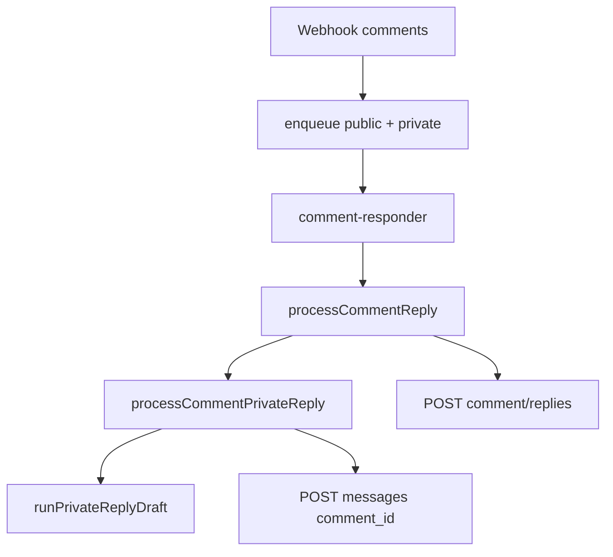

# Campanhas interativas — agente temporizado e private reply

> Detail doc para EPIC-19 / v1.29. Overview em `docs/05_architecture.md`.

## Problema

Posts de promoção precisam de agente ativo só durante a campanha, e cupons/links devem ir ao inbox (DM) em vez do thread público. O Iris já filtra comentários antigos via `reply_max_age_days` global — isso mede **idade do comentário**, não **vida da campanha no post**.

## Campos

| Campo | Onde | Significado |
| ----- | ---- | ----------- |
| `agent_active_days` | `posts` | Dias após `published_at` (fallback `created_at`) em que o agente responde neste post. `null` = sem limite. |
| `private_reply_mode` | `posts` | `inherit` \| `off` \| `auto` \| `draft` — DM via Meta private reply após comentário. |
| `private_reply_mode` | `app_settings` | Default global quando post usa `inherit`. |
| `comment_replies.channel` | `public` \| `private` | Separa resposta pública da private reply na mesma tabela. |

## Janela agente ativo no post

- Cálculo: `published_at + agent_active_days` (ou `created_at` se sem publish).
- Gates em `enqueueCommentReply`, `enqueueCommentPrivateReply`, `processCommentReply`, `processCommentPrivateReply`.
- Mensagem guardrail: `[guardrail] post agent campaign expired`.

## Meta private reply API

- Endpoint: `POST graph.instagram.com/{version}/me/messages`
- Body: `{ recipient: { comment_id }, message: { text } }`
- Regras Meta: **uma** mensagem por comentário; até **7 dias** desde criação do comentário; follow-up só se usuário responde na DM (janela 24h).
- Implementação: `MetaMessageSender.sendPrivateReplyToComment` em `graph-api-message-sender.ts`.
- Permissões: `instagram_manage_comments`, `pages_messaging`.

## Pipeline

- Resposta pública e private reply são independentes na API Meta.
- Private auto aguarda public draft aprovado se `reply_mode=draft`.
- Harness DM: `runPrivateReplyDraft` + complement `privateDmOnly`.

## Testes

- `post-agent-active.test.ts` — TTL desde publish.
- `comment-private-reply-window.test.ts` — 7 dias Meta.
- `graph-api-message-sender.test.ts` — `comment_id` recipient.

## Diagrama

[iris-post-campaign-private-reply.md](diagrams/iris-post-campaign-private-reply.md)

## Schema

Ver migration `YYYYMMDDHHMMSS_post_campaign_agent_private_reply.sql` e `docs/06_database.md`.
